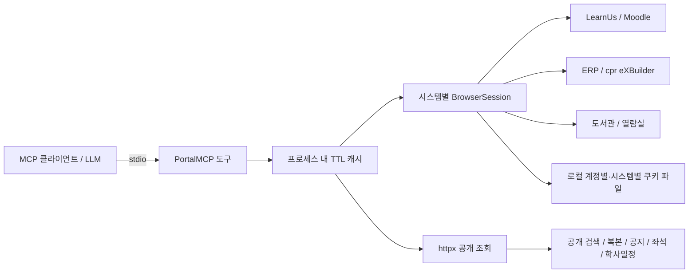

# 연세대학교 포털 MCP 설계

현재 구현의 구조와 개발 제약을 설명합니다. 설치는 [README](README.md),
도구별 계약은 [도구 참조](docs/TOOLS.md), 검증·릴리스 절차는 [개발 가이드](docs/DEVELOPMENT.md)를 참고하세요.

## 1. 범위와 상태

개인용 **읽기 전용 stdio MCP 서버**입니다. 로그인과 조회용 검색 외에 예약·취소·연장·신청·제출·결제를 실행하지 않습니다.
UI, 다중 사용자 서비스, 쓰기 도구는 현재 범위가 아닙니다.
공개 도구는 LearnUs 14개, 도서관 9개, ERP 6개, 일정 4개로 총 33개입니다.
내부 함수·실험 코드·포털 메뉴의 존재를 공개 지원으로 취급하지 않습니다.

## 2. 구현 구조

| 구현 파일 | 책임 |
| --- | --- |
| [src/yonsei_portal_mcp/server.py](src/yonsei_portal_mcp/server.py) | 도구 등록, 입력·개인정보 옵션, 캐시 키, 종료 훅 |
| [src/yonsei_portal_mcp/session.py](src/yonsei_portal_mcp/session.py) | 브라우저 지연 기동, 인증·잠금·재시도·정리 |
| [src/yonsei_portal_mcp/config.py](src/yonsei_portal_mcp/config.py) | 환경변수 우선 설정 로딩 |
| [src/yonsei_portal_mcp/cache.py](src/yonsei_portal_mcp/cache.py) | 도구·계정·인자별 TTL 캐시 |
| [src/yonsei_portal_mcp/httpclient.py](src/yonsei_portal_mcp/httpclient.py) | 공개 HTTP, TLS 검증, HTML 동일 출처 리다이렉트 제한 |
| [src/yonsei_portal_mcp/scrapers/learnus.py](src/yonsei_portal_mcp/scrapers/learnus.py) | 한국어 수집, 강좌·마감·공지·자료·과제·성적부·강좌 이력 |
| [src/yonsei_portal_mcp/scrapers/boards.py](src/yonsei_portal_mcp/scrapers/boards.py) | 강좌 게시판·글 목록, 작성자·숨김/링크 없는 제목 제외 |
| [src/yonsei_portal_mcp/scrapers/library.py](src/yonsei_portal_mcp/scrapers/library.py) | 도서·공지·개인 대출/예약/이력·열람실 |
| [src/yonsei_portal_mcp/scrapers/erp.py](src/yonsei_portal_mcp/scrapers/erp.py) | 메뉴 조작 후 조회 JSON 캡처·정규화 |
| [src/yonsei_portal_mcp/scrapers/seats.py](src/yonsei_portal_mcp/scrapers/seats.py) | 공개 좌석 JSON 집계 |
| [src/yonsei_portal_mcp/scrapers/academic.py](src/yonsei_portal_mcp/scrapers/academic.py) | 공개 학사일정의 월별 원문 날짜·제목 |
| [src/yonsei_portal_mcp/ics.py](src/yonsei_portal_mcp/ics.py) | 일정 합성·마감 ICS·명시적 입력 기반 반복 ICS |

ERP 화면은 cpr/eXBuilder의 `.clx.js` 기반입니다.
학교 대기열과 실제 조회 UI를 거쳐 `*.do` 응답을 읽으며, 대기열 우회나 쓰기 API 직접 호출은 하지 않습니다.
공개 HTTP는 certifi와 동봉된 Sectigo 중간 인증서로 TLS를 검증합니다. HTML 리다이렉트는 같은 출처 HTTPS로 최대 5회 요청합니다.

## 3. 데이터 처리 원칙

공개 입력의 기준은 `tools/list`입니다. 반환 필드·페이지 범위·캐시는 [도구 참조](docs/TOOLS.md)에서 관리합니다.

- 오류·로딩·미확인 상태를 정상 0건이나 0점으로 바꾸지 않습니다. 빈 결과는 원문의 명시적 표식으로 확인합니다.
- 필터는 요청 전송뿐 아니라 선택된 조건과 응답 행을 검증합니다. 세 이력 도구는 지원하지 않는 추가 인자를 SDK 처리 전에 거절합니다.
- 원문 전체 건수·출력 제한·로컬 잘림·후속 페이지를 구분합니다. 페이지 사이 변경 가능성이 있으므로 ID 중복과 수집 건수를 대조해야 합니다.
- 달력의 진도/수료와 제출 과제, LMS 점수와 ERP 성적, 자료 건수와 복본 수, 좌석 잔여와 배정 가능을 구분합니다.
- LearnUs는 `lang=ko`와 실제 DOM 언어·대상 ID를 검증합니다. ERP 성적의 `dsSgra100`은 과목, `dsSgra120`은 학기 데이터입니다.
- 개인정보 옵션은 기본 최소화하되 도구 응답 전체가 비식별화됐다고 가정하지 않습니다. 게시판 목록의 본문 제외는 다른 도구 호출을 차단하는 권한 장치가 아닙니다.
- 학사 시각은 KST 기준, 수집시각은 오프셋을 포함한 ISO8601입니다. 날짜만 있는 마감에 임의 시각을 넣지 않습니다.
- 반복 시간표 ICS는 사용자가 확인한 기간·교시·제외일로 생성하며 미지원 시간 표현을 부분 결과로 숨기지 않습니다.

## 4. 설정·세션·운영

### 인증과 저장

- LearnUs는 `a.btn-sso` 클릭 후 통합인증 폼, ERP는 별도 SSO, 도서관은 자체 SSO 로그인 폼을 사용합니다. 브라우저는 사용자에게 허용된 읽기 흐름만 재현합니다.
- 명시적 환경변수가 설정 파일보다 우선합니다(`override=False`). 설정 변경 뒤에는 서버를 재시작해야 합니다.
- 쿠키는 `YONSEI_STORAGE_STATE`의 부모 경로 아래 `SHA256(계정 ID)/시스템/파일명`으로 분리합니다. 기존 공용 쿠키는 자동 이관·재사용하지 않습니다.
- 파일명 해시는 암호화가 아닙니다. 자격 증명과 쿠키는 민감한 로컬 파일이며 Git에 포함하지 않습니다. OS 키체인·쿠키 암호화는 미구현입니다.
- 쿠키 파일 권한은 코드가 자동 강제하지 않습니다. 운영체제 접근 권한을 직접 제한하고 여러 프로세스의 같은 쿠키 경로 공유도 피합니다.
- 프로필의 이름·학번과 성적 피드백은 기본 제외합니다. 성적·출석·도서명 자체는 여전히 개인정보이며 MCP 클라이언트/LLM에 전달됩니다.
- `RUN_LIVE_PORTAL`/`RUN_LIVE_LLM`은 테스트 하니스의 실행 게이트입니다. 공개 MCP 도구 호출을 차단하는 서버 정책이나 네트워크 방화벽이 아닙니다.

### 생명주기와 오류

- 브라우저는 지연 기동하고 시스템별 잠금으로 조회를 직렬화합니다. 재시도 중에도 잠금을 유지하며 시작 실패·세션 무효화·서버 종료에서 브라우저와 드라이버를 정리합니다.
- 자격 증명 없음/실행 중 설정 변경은 `AUTH_REQUIRED`, 로그인 실패는 `AUTH_FAILED`, 추가 인증 필요는 `MFA_REQUIRED`입니다. 이 오류는 자동 인증 재시도를 하지 않습니다.
- 다른 조회 오류는 새 세션으로 한 번 재시도할 수 있습니다. 재시도 후 브라우저 타임아웃은 `SESSION_EXPIRED`, 파싱·일반 조회 실패는 `SCRAPE_FAILED`로 처리합니다.
- `UPSTREAM_TIMEOUT` 타입은 정의돼 있으나 모든 HTTP 오류가 그 코드로 변환되거나 지수 백오프되는 것은 아닙니다. `YONSEI_NAV_TIMEOUT_MS`도 모든 대기시간을 통제하지 않습니다.
- 브라우저 종료는 학교 측 로그아웃·쿠키 철회를 의미하지 않습니다. 전역 오류 비식별화나 모든 개인정보 마스킹이 완성됐다고 가정하지 않습니다.

### 캐시와 호출 부하

| 데이터 | 현재 TTL |
| --- | --- |
| 강좌·자료·과거강좌·ERP 프로필/시간표/성적·공식 학사일정 | 30분 |
| 마감·공지 목록·과제 상태·성적부·게시판·도서 검색/복본·개인 대출/예약/이력·시험·장학수혜 | 5분 |
| 공지 본문 | 30분 |
| 공개 좌석·열람실 | 60초 |

캐시 키는 계정과 조회 인자를 반영하고 공개 데이터는 계정이 필요 없습니다.
동일 키의 진행 중 요청 합치기, 캐시 크기 제한, 공통 최소 호출 간격과 HTTP 백오프는 미구현입니다.
시스템별 잠금만으로 모든 서버 호출의 레이트리밋이 보장된다고 설명하지 않습니다.

## 5. 미완료 작업

아래는 지원 기능이 아니라 검증 후 범위를 정할 개발 후보입니다.

| 항목 | 현재 상태와 필요한 근거 |
| --- | --- |
| 도서관 이력 날짜·후속 페이지 | 내부 실험만 존재. 실제 비어 있지 않은 이력으로 날짜별 변화·페이지 합계·중복 대조 필요 |
| 강의계획서 | `.crf` 경로만 확인. 뷰어 본문·권한·과목 식별자 검증 필요 |
| 장학 공고·마감 통합 | 원문 소스와 날짜·중복 계약 필요. 장학수혜내역과 별개 |
| 게시판 본문·후속 페이지 | 목록만 지원. 접근 가능한 글·페이지 표본과 개인정보·첨부 범위 확인 필요 |
| 공식 교시·학기 연결 | 사용자 입력만 지원. 캠퍼스·과정별 근거와 휴강/휴일 처리 기준 필요 |
| 추가 조회·출력 지역화 | 지도교수 공지·강의평가·본인 시설 예약·메일·졸업요건은 접근/표본 미확인. 출력 번역은 미구현 |
| 운영 안정성 | 중복 요청 합치기·캐시 크기·호출 간격·오류 통일·비밀 저장 보강 필요 |
| 지원 환경 확대 | Ubuntu/Python 3.10·3.11·3.12 CI 구성. Windows/macOS 및 다양한 계정의 실접속 검증은 남아 있음. [릴리스 체크리스트](docs/DEVELOPMENT.md) 참고 |

변경 시 원문 근거와 실패/빈 상태 회귀 테스트를 함께 확보합니다. 검증 결과와 실행 명령은
[개발 가이드](docs/DEVELOPMENT.md), 사용자에게 영향을 주는 계약 변경은 [CHANGELOG](CHANGELOG.md)에 기록합니다.