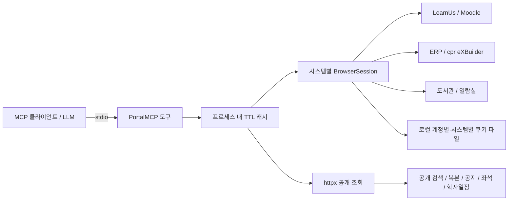

# 연세대학교 포털 MCP 설계

기준일: 2026-09-25. 이 문서는 현재 작업 트리의 설계와 검증 범위를 설명합니다.
패키지 버전은 0.4.0이며 이후 변경은 `Unreleased`입니다. Git 푸시는 PyPI 배포가 아닙니다.

## 문서 안내

| 문서 | 역할 |
| --- | --- |
| [README.md](README.md) | 설치·설정·클라이언트 연결·공개 도구 사용법 |
| [DESIGN.md](DESIGN.md) | 현재 설계·제약·검증 근거·개발 백로그 |
| [CHANGELOG.md](CHANGELOG.md) | 미출시 변경과 버전별 변경 기록 |
| [docs/archive/design-history-2026-09-25.md](docs/archive/design-history-2026-09-25.md) | 정리 전 설계 전문. 초기 메뉴 조사·비교 분석·변경된 계획 보존 |

기존 코드 주석의 `DESIGN §2.5`, `§4-ter`, `§5.1`, `§10.x`, `§11.4`, `§12`는
보존본의 절 번호입니다. 구현 판단은 보존본의 체크 표시가 아니라 현재 코드와 이 문서를 따릅니다.

## 1. 범위와 상태

개인용 **읽기 전용 stdio MCP 서버**입니다. 로그인과 조회용 검색 외에 예약·취소·연장·신청·제출·결제를 실행하지 않습니다.
UI, 다중 사용자 서비스, 쓰기 도구는 현재 범위가 아닙니다. 과거 쓰기 설계는 실행 승인이나 구현 완료를 뜻하지 않습니다.

공개 도구는 총 **33개**입니다. 분류상 공지 본문 도구는 LearnUs에 포함하되 도서관 공개 본문도 처리합니다.

| 영역 | 수 | 등록 도구 |
| --- | --- | --- |
| LearnUs | 14 | `get_lms_courses`, `get_lms_deadlines`, `get_lms_notices`, `search_notices`, `get_notice`, `get_lms_attendance`, `get_lms_course_materials`, `get_lms_assignments`, `get_lms_assignment_status`, `get_lms_course_history`, `get_lms_gradebook`, `get_lms_overview`, `get_lms_boards`, `get_lms_board_posts` |
| 도서관 | 9 | `get_my_loans`, `get_my_reservations`, `get_my_loan_history`, `get_my_reservation_history`, `get_library_seats`, `get_library_seat_rooms`, `search_library_books`, `get_library_book_detail`, `get_library_notices` |
| ERP | 6 | `get_student_profile`, `get_my_timetable`, `get_grades`, `search_courses`, `get_exam_schedule`, `get_scholarship_history` |
| 일정 | 4 | `export_calendar_ics`, `export_timetable_ics`, `get_my_schedule`, `get_academic_calendar` |

- **공개 지원:** MCP 스키마에 등록된 계약. 모든 계정 상태가 실측됐다는 뜻은 아닙니다.
- **실접속 검증:** 실제 화면·응답과 비교한 특정 계정·시점·경로의 증거.
- **내부 실험:** 코드나 합성 테스트만 존재하며 공개 지원으로 취급하지 않는 기능.
- **미검증/미구현:** 데이터 접근 또는 구현·검증이 남아 있는 작업.

## 2. 구현 구조



| 구현 파일 | 책임 |
| --- | --- |
| [src/yonsei_portal_mcp/server.py](src/yonsei_portal_mcp/server.py) | 도구 등록, 입력·개인정보 옵션, 캐시 키, 종료 훅 |
| [src/yonsei_portal_mcp/session.py](src/yonsei_portal_mcp/session.py) | 브라우저 지연 기동, 인증·잠금·재시도·정리 |
| [src/yonsei_portal_mcp/config.py](src/yonsei_portal_mcp/config.py) | 환경변수 우선 설정 로딩 |
| [src/yonsei_portal_mcp/cache.py](src/yonsei_portal_mcp/cache.py) | 도구·계정·인자별 TTL 캐시 |
| [src/yonsei_portal_mcp/httpclient.py](src/yonsei_portal_mcp/httpclient.py) | 공개 HTTP, TLS 검증, HTML 동일 출처 리다이렉트 제한 |
| [src/yonsei_portal_mcp/scrapers/learnus.py](src/yonsei_portal_mcp/scrapers/learnus.py) | 한국어 수집, 강좌·마감·공지·자료·과제·성적부·강좌 이력 |
| [src/yonsei_portal_mcp/scrapers/boards.py](src/yonsei_portal_mcp/scrapers/boards.py) | 강좌 게시판·글 목록, 작성자·숨김/링크 없는 제목 제외 |
| [src/yonsei_portal_mcp/scrapers/library.py](src/yonsei_portal_mcp/scrapers/library.py) | 도서·공지·개인 대출/예약/이력·열람실 |
| [src/yonsei_portal_mcp/scrapers/erp.py](src/yonsei_portal_mcp/scrapers/erp.py) | 메뉴 조작 후 조회 JSON 캡처·정규화 |
| [src/yonsei_portal_mcp/scrapers/seats.py](src/yonsei_portal_mcp/scrapers/seats.py) | 공개 좌석 JSON 집계 |
| [src/yonsei_portal_mcp/scrapers/academic.py](src/yonsei_portal_mcp/scrapers/academic.py) | 공개 학사일정의 월별 원문 날짜·제목 |
| [src/yonsei_portal_mcp/ics.py](src/yonsei_portal_mcp/ics.py) | 일정 합성·마감 ICS·명시적 입력 기반 반복 ICS |

ERP는 초기 문서에서 WebSquare로 불렀으나 최근 실측 화면은 cpr/eXBuilder의 `.clx.js`입니다.
학교 대기열과 실제 조회 UI를 거쳐 `*.do` 응답을 읽으며, 대기열 우회나 쓰기 API 직접 호출은 하지 않습니다.
공개 HTTP는 certifi와 동봉된 Sectigo 중간 인증서로 TLS를 검증합니다. HTML 리다이렉트는 같은 출처 HTTPS로 최대 5회 요청합니다.

## 3. 공개 데이터 계약

정확한 입력·출력 스키마의 기준은 실행 중 서버의 `tools/list`입니다. 사용 예는 README를 따릅니다.
옛 계획의 `list_notices`, `get_enrollment`, `get_syllabus`, `summarize_notice`는 현재 등록 도구가 아닙니다.
현재 시간표가 수강신청내역을 제공하며, 요약은 MCP 서버가 아니라 호출한 LLM이 수행합니다.

### 이력 조회

| 도구 | 공개 입력 | 범위와 금지된 해석 |
| --- | --- | --- |
| `get_my_loan_history` | 없음 | 기본 표시 페이지. 날짜·페이지 지정 미지원. 빈 날짜 입력은 전체 기간을 뜻하지 않음 |
| `get_my_reservation_history` | 없음 | 기본 화면의 이전 도서 예약 이력. 현재 예약·시설 예약과 별개 |
| `get_lms_course_history` | `year`, `semester` | 선택 조건과 행 연도/학기를 검증한 `displayed_result`. 비교과를 포함한 모든 강좌 이력이라는 보장 없음 |

도서관 이력의 `count`는 반환 행 수입니다. `total`, `has_next`, `next_page`는 확인 가능한 경우만 반환하므로 미반환을 0/false로 해석하지 않습니다.
과거강좌는 `filters_verified=true`, `pagination_supported=false`, `has_next=null`이며, 응답 `page=1`은 내부 호환값입니다.
세 이력 도구는 추가 인자를 스키마와 실제 호출에서 거절합니다. SDK가 인자를 버리고 기본 결과를 반환하지 않도록 별도 검증합니다.

내부 도서관 날짜·페이지 처리 및 합성 테스트는 남아 있지만 **공개 지원은 철회**했습니다.
실제 GET 요청이 날짜를 전송한 사실과 필터가 적용됐다는 사실은 별개입니다. 재공개 조건은 6절을 따릅니다.

### LearnUs

- 수집 언어는 모든 조회에서 `lang=ko`로 고정하고 실제 DOM 언어를 확인합니다. 리다이렉트가 언어 인자를 소비해도 강좌·과제·게시판 ID는 검사합니다.
- 마감은 현재 **달력 기반**입니다. `progress`/`completion`은 강의 진도·수료 마커이며 제출 과제가 아닙니다. 과제 상세·게시판 날짜를 자동 병합하지 않습니다.
- 과제 목록은 자료 중 `assign` 활동만 추립니다. 제출 상태와 채점 상태는 독립적이며 제출물 본문·첨부파일은 반환하지 않습니다.
- 성적부는 ERP 확정 성적과 다릅니다. 분류·항목·소계/총계를 중복 합산하지 않으며 `-`, 빈 값, 숨김은 0점이 아닙니다. 피드백은 명시적 opt-in입니다.
- 게시판 목록은 강좌 표만 읽습니다. 글 목록은 첫 표시 페이지의 제목·날짜·링크이며 작성자·본문·첨부파일을 수집하지 않습니다. 링크 없는 행은 `unlinked_count`로만 표시합니다.
- 게시판 목록의 본문 제외 정책은 별도 `get_notice` 호출까지 금지하는 권한 장치가 아닙니다. 클라이언트도 사용자가 허용한 조회 범위를 지켜야 합니다.
- 오류 화면·로딩 중 빈 자료 컨테이너를 정상 0건으로 처리하지 않습니다. 숫자 날짜는 달력 유효성을 검증하며 알 수 없는 날짜를 만들지 않습니다.

### ERP와 도서관

- `get_grades`는 `year`/`term_code` 필터를 제공하지만 `summary_scope=all_terms`의 GPA·취득학점은 누적입니다. 원문 데이터셋은 `dsSgra100`=과목, `dsSgra120`=학기입니다.
- 시간표는 현재 수강신청내역의 주간 교시 패턴입니다. 소수 학점을 보존하고 미지원 범위·격주 표현은 원문을 남깁니다. `slots=[]`를 수업 없음으로 해석하지 않습니다.
- 수강편람은 교과목명·연도·학기·캠퍼스 검색입니다. 학교 응답 상한 200건과 로컬 limit을 구분하며 `truncated=true`의 0건을 전체 검색 결과 0건으로 단정하지 않습니다. 정원·수강인원·계획서는 제외합니다.
- 시험의 `period_configured=false`는 조회기간 미등록이지 시험 없음이 아닙니다. 장학수혜내역은 신청가능 장학금 공고가 아닙니다.
- 복본 상세는 확인한 `CATTOT`+숫자 ID만 지원합니다. 빈 반납예정일이나 상태 문구만으로 예약 가능 여부를 추정하지 않습니다.
- 공개 좌석 집계와 로그인 열람실은 범위·갱신이 다릅니다. 열람실 `available`은 원문 잔여석, `assignable_available`은 배정불가 방을 제외한 합계이며 실제 착석을 보장하지 않습니다.
- 도서관 공지 본문의 이미지 내용은 추출하지 않습니다. `image_count`와 원문 링크를 함께 확인합니다.

### 일정과 시각

- 해석된 학사 시각과 상대 날짜 계산은 KST 기준입니다. 수집시각은 ISO8601 오프셋을 포함하며 일부 공개/도서관 조회는 UTC입니다. 모든 필드가 KST라는 과거 설명은 적용하지 않습니다.
- `get_my_schedule`의 기간 필터는 마감·반납일에 적용합니다. 주간 시간표와 선택적 중간/기말 결과는 별도 범위이며 `generated_at`은 원천 갱신시각이 아닙니다.
- 마감 ICS는 순간 이벤트로 `DTEND`를 생략하고 도서 반납일은 종일 이벤트로 만듭니다. 날짜만 있는 마감을 임의 자정으로 만들지 않습니다.
- 반복 시간표 ICS에는 **사용자가 확인한 기간·교시별 시각·제외일**이 필요합니다. 공식 시간표·공휴일·휴강을 자동 발견하지 않습니다. 누락 교시나 미지원 시간 표현은 부분 내보내기 대신 거절합니다.
- 공개 학사일정은 현재 표시 학기와 원문 날짜를 보존합니다. 월 경계 반복 항목이나 일반 학사일정을 개인별 실제 수업일로 단정하지 않습니다.

## 4. 설정·세션·운영

### 인증과 저장

- LearnUs는 `a.btn-sso` 클릭 후 통합인증 폼, ERP는 별도 SSO, 도서관은 자체 SSO 로그인 폼을 사용합니다. 브라우저는 사용자에게 허용된 읽기 흐름만 재현합니다.
- 명시적 환경변수가 설정 파일보다 우선합니다(`override=False`). 설정 변경 뒤에는 서버를 재시작해야 합니다.
- 쿠키는 `YONSEI_STORAGE_STATE`의 부모 경로 아래 `SHA256(계정 ID)/시스템/파일명`으로 분리합니다. 기존 공용 쿠키는 자동 이관·재사용하지 않습니다.
- 파일명 해시는 암호화가 아닙니다. 자격 증명과 쿠키는 민감한 로컬 파일이며 Git에 포함하지 않습니다. OS 키체인·쿠키 암호화는 미구현입니다.
- 프로필의 이름·학번과 성적 피드백은 기본 제외합니다. 성적·출석·도서명 자체는 여전히 개인정보이며 MCP 클라이언트/LLM에 전달됩니다.

### 생명주기와 오류

- 브라우저는 지연 기동하고 시스템별 잠금으로 조회를 직렬화합니다. 재시도 중에도 잠금을 유지하며 시작 실패·세션 무효화·서버 종료에서 브라우저와 드라이버를 정리합니다.
- 자격 증명 없음/실행 중 설정 변경은 `AUTH_REQUIRED`, 로그인 실패는 `AUTH_FAILED`, 추가 인증 필요는 `MFA_REQUIRED`입니다. 이 오류는 자동 인증 재시도를 하지 않습니다.
- 다른 조회 오류는 새 세션으로 한 번 재시도할 수 있습니다. 재시도 후 브라우저 타임아웃은 `SESSION_EXPIRED`, 파싱·일반 조회 실패는 `SCRAPE_FAILED`로 처리합니다.
- `UPSTREAM_TIMEOUT` 타입은 정의돼 있으나 모든 HTTP 오류가 그 코드로 변환되거나 지수 백오프되는 것은 아닙니다. `YONSEI_NAV_TIMEOUT_MS`도 모든 대기시간을 통제하지 않습니다.
- 브라우저 종료는 학교 측 로그아웃·쿠키 철회를 의미하지 않습니다. 전역 오류 비식별화나 모든 개인정보 마스킹이 완성됐다고 가정하지 않습니다.

### 캐시와 호출 부하

| 데이터 | 현재 TTL |
| --- | --- |
| 강좌·자료·과거강좌·ERP 프로필/시간표/성적·공식 학사일정 | 30분 |
| 마감·공지 목록·과제 상태·성적부·게시판·도서 검색/복본·개인 대출/예약/이력·시험·장학수혜 | 5분 |
| 공지 본문 | 30분 |
| 공개 좌석·열람실 | 60초 |

캐시 키는 계정과 조회 인자를 반영하고 공개 데이터는 계정이 필요 없습니다.
동일 키의 진행 중 요청 합치기, 캐시 크기 제한, 공통 최소 호출 간격과 HTTP 백오프는 미구현입니다.
시스템별 잠금만으로 모든 서버 호출의 레이트리밋이 보장된다고 설명하지 않습니다.

## 5. 검증 근거와 실행

다음은 **2026-09-25까지 수행한 실행 기록**이며 배포 보증이나 모든 계정에 대한 검증이 아닙니다.

| 확인 대상 | 확보한 증거 | 남은 한계 |
| --- | --- | --- |
| 자동 테스트 | 최근 오프라인 696개, 포털 전용 실접속 7개 통과 | 두 실행을 전체 LLM 포함 단일 실행 결과처럼 합산하지 않음 |
| LLM | 이전 공개 계약에서 Azure 시나리오 33개 통과 | 이력 옵션 철회 후 전체 시나리오 재실행 기록은 아님. OpenAI/Claude/Gemini 직접 API 실검증 없음 |
| 도서관 날짜·페이지 | 실제 검색 버튼이 `dtf`/`dtt`/`pn` GET을 전송. 대출 0건·예약 1건, 2페이지 링크 없음 | 원본 HTML의 날짜값 미반환과 0건만으로 필터 적용 여부·실패 원인을 판단할 수 없음 |
| 과거강좌 | 전체 표시 10건 = 학기별 합집합 6+0+4+0. 연도 조건도 부분집합과 일치. 중복/숨은 페이지 제어 없음 | 현재 강좌 6개 중 비교과 2개는 이력 화면에 없음. 시스템 전체 이력 완전성의 증거가 아님 |
| 게시판 | 현재 3개·과거 4개 게시판, 링크 글 2개와 링크 없는 행 2개 원문 대조 | 본문·후속 페이지 미수집 |
| 성적·과제 | ERP 과목 5개와 누적 요약, 현재/과거 성적부, 과제 상태 DOM 대조 | 다양한 계정·모든 제출/채점 상태의 실표본은 아님 |
| 시험·장학·대출 | 명시적 빈 응답/미등록 상태 확인 | 비어 있지 않은 시험·장학수혜·대출 이력은 합성/정적 정의 기반 |
| 좌석·일정 | 열람실 합계 중복 수정 후 원문 대조, 공식 일정 표시 51항목, 반복 ICS 구조 검증 | 수치는 스냅샷. 공식 교시 자동 매핑·다른 캠퍼스 검증 아님 |

실패 조건은 합성 회귀 테스트로 고정하고, 실제 데이터는 메모리에서 원문과 대조합니다.
자동 검증 진단은 도구 이름·오류 종류·건수·일치 여부로 제한합니다. 데모/시나리오 CLI는 답변을 출력하며,
[tests/llm/dump_tools.py](tests/llm/dump_tools.py)는 인자와 도구 응답 원문을 출력합니다. 이런 수동 출력에는 개인정보가 포함될 수 있으므로 공유하지 않습니다.
LLM 검사는 기대 도구와 주요 필터 인자·도구 오류·응답 완료·최종 답변을 검사하지만 모든 자연어 답변의 정확성을 증명하지 않습니다.

```bash
# 테스트 의존성 및 로컬 DOM 테스트용 Chromium
uv sync --extra llm
uv run playwright install chromium

# 네트워크 없는 회귀: 로그인 설정과 실접속 게이트를 비활성화
PYTHON_DOTENV_DISABLED=1 RUN_LIVE_PORTAL=0 RUN_LIVE_LLM=0 uv run pytest -m "not live" -q

# 실제 포털만 확인. 본인 계정의 읽기 전용 접근이 필요함
RUN_LIVE_PORTAL=1 RUN_LIVE_LLM=0 uv run pytest tests/test_live_tools.py -q --tb=no --show-capture=no

# 외부 LLM에 실제 학사정보를 전송하는 선택적 검사
RUN_LIVE_LLM=1 uv run pytest tests/llm -q --tb=no --show-capture=no

uv lock --check
git -c core.whitespace=cr-at-eol diff --check
```

실행마다 결과를 기록합니다. 과거 성공 수치를 새 수정의 검증 결과로 재사용하지 않습니다.
기본 pytest는 `test_*.py`만 수집합니다. 수동 `smoke*.py`/프로브는 자동 검증 범위가 아니며 CI 워크플로도 아직 없습니다.

## 6. 미완료 작업과 재개 조건

아래는 후보 우선순위이지 구현 승인이나 약속이 아닙니다. 실제 접근·데이터 근거를 확보한 뒤 범위를 정합니다.

| 우선 | 항목 | 상태 | 착수/완료 조건 |
| --- | --- | --- | --- |
| 1 | 도서관 날짜·후속 페이지 | 공개 옵션 철회, 내부 실험 | 실제 이력 표본으로 날짜 구간별 결과 변화와 페이지별 행·합계·중복을 대조한 뒤 스키마 재공개 |
| 1 | 기존 조회 정확성 유지 | 회귀 테스트 운영 중 | 학교 DOM/응답 변경과 빈 상태를 원문으로 확인. 새 필드는 증거 없이 추정하지 않음 |
| 2 | 강의계획서 | `.crf` 경로만 확인 | 실제 뷰어 진입·본문 추출·권한·과목 식별자 대조 |
| 2 | 장학 공고·통합 검색·마감 범위 | 미구현 | 수혜내역과 모집 공고를 분리. 원문 소스를 확보한 뒤 범위/날짜/중복 계약 정의 |
| 2 | 게시판 본문·후속 페이지 | 목록만 지원 | 접근 가능한 글·페이지 표본, 개인정보 최소화와 첨부 범위 확인 |
| 3 | 지도교수 공지·강의평가 결과 | 메뉴/초기 응답만 확인 | 공지는 `학적` 메뉴이며 현재 교수 선택 0명. 실제 글/결과 없이 임의 ID를 사용하지 않음 |
| 3 | 시설·좌석 본인 예약내역 | 시설 선택 UI만 확인 | 개인 내역 응답과 목록 대조. 예약 제출과 분리 |
| 3 | 공식 교시·학기 자동 연결 | 미구현 | 캠퍼스·과정별 공식 근거, 휴강/휴일 처리 기준 확보 |
| 3 | 출력 지역화 L1/L2 | L0 수집 언어 고정만 완료 | ERP 공식 영문명 활용과 라벨 분리. `PORTAL_DISPLAY_LANG`는 현재 설정이 아님 |
| 운영 | 캐시·호출 부하·오류 통일 | 일부 설계만 존재 | 진행 중 중복 요청/크기/최소 간격 테스트, 모든 전송 경로의 오류·타임아웃 검증 |
| 운영 | CI·배포·비밀 저장 | 로컬 빌드 구성 존재 | Python 지원 버전·설치 wheel 검증, 공개 CI에서 실접속 금지. PyPI 배포는 별도 승인 |
| 보류 | 전자출결·메일·학부 졸업요건·추가 캠퍼스 | 접근/표본 미확인 | 해당 계정·시스템 권한과 읽기 전용 경로 확보 |
| 제외 | UI·연장·예약·신청·제출·결제 | 현재 범위 밖 | 별도 범위 합의 필요. 과거 write 계획이나 토큰 설계는 동작하는 안전장치가 아님 |

## 7. 문서 유지 규칙

1. 공개 기능의 기준은 `server.py` 등록과 `tools/list`입니다. 내부 함수·샘플 테스트·포털 메뉴의 존재를 공개 지원으로 표시하지 않습니다.
2. 입력 제거·기본값·범위 변경은 README와 CHANGELOG에 함께 반영합니다. 이력 날짜/페이지 옵션 철회가 이 원칙의 사례입니다.
3. 검증에는 날짜·명령·표본 범위·실패/미검증 조건을 기록합니다. 개인 원문·자격 증명·쿠키는 저장하지 않습니다.
4. 현재 설계는 이 문서에서 갱신하고 과거 조사는 보존본에 둡니다. 이전 버전의 CHANGELOG 내용은 현재 동작에 맞춰 덮어쓰지 않습니다.
5. Git 커밋·푸시, 패키지 빌드, PyPI 릴리스는 별개입니다. 푸시만으로 배포·전체 검증 완료를 주장하지 않습니다.