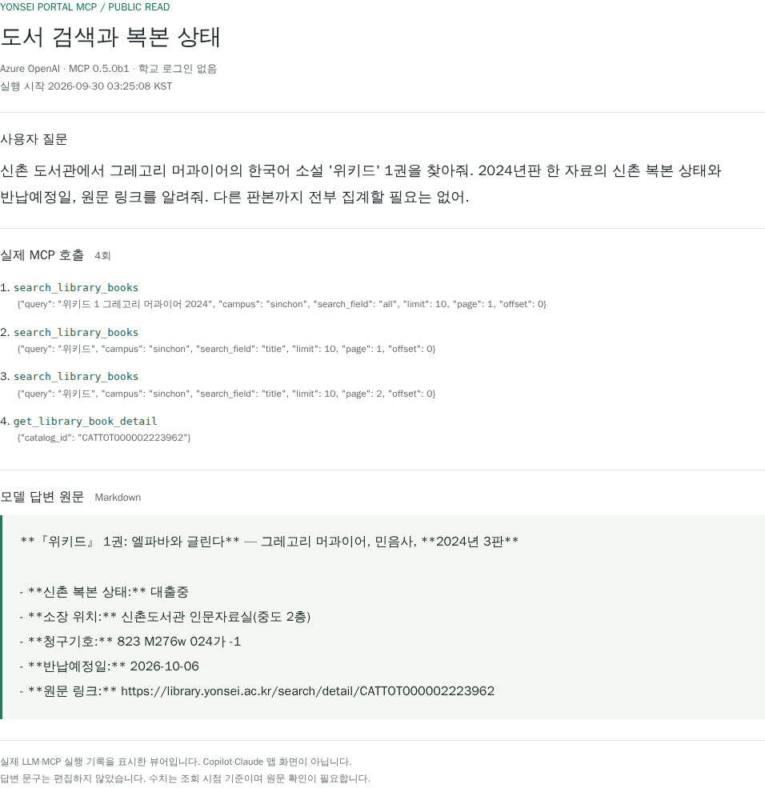
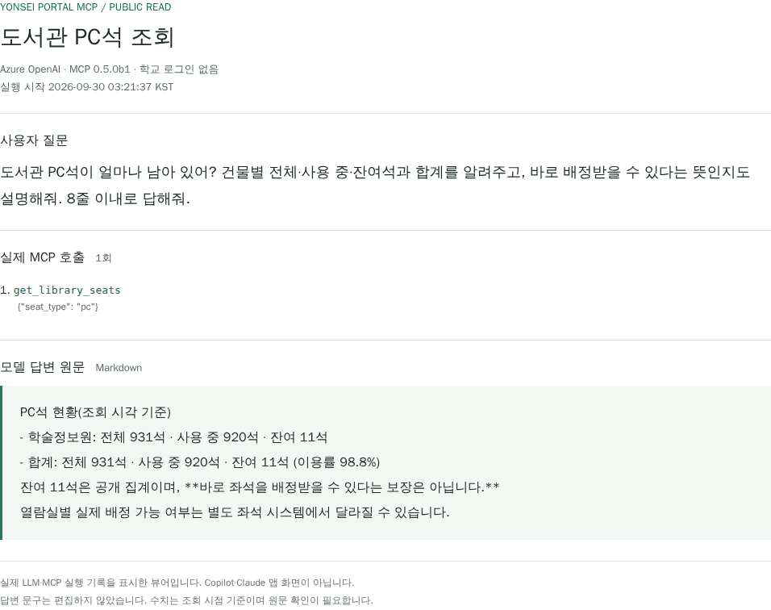
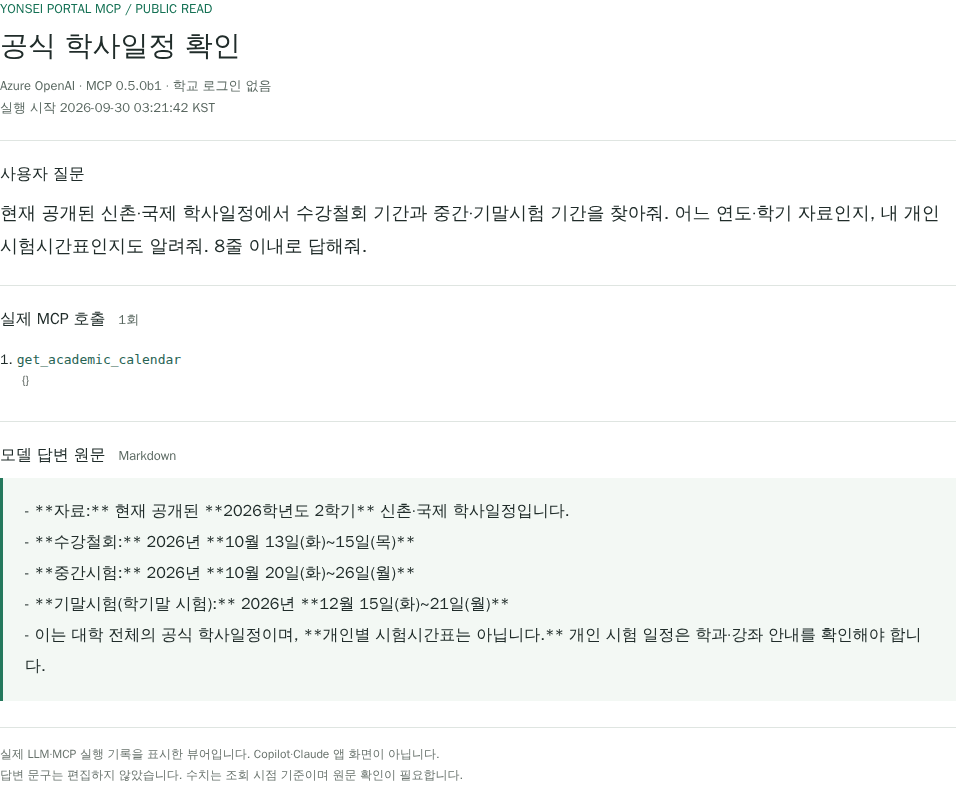

# 실제 질문으로 보는 사용 가이드

MCP에 무엇을 물어보고, 어떤 도구가 호출되며, 답변에서 무엇을 확인해야 하는지 실제 대화 3건으로 살펴봅니다.
**PC석 사례는 의미 검증에 실패한 과거 응답입니다. 현재 사용 예시로 따라 하지 마세요.** 도서·학사일정 사례와 달리 숫자를 이용 가능 여부로 해석할 수 없으며, 아래에 현재 계약과 대체 조회 방법을 명시했습니다.
설치·연결은 [README](../README.md#빠른-시작), 전체 지원 기능은 [기능 목록](../README.md#지원-기능-전체-목록), 인자·반환값은 [API 참조](TOOLS.md)를 확인하세요.

## 시작하기

1. [클라이언트 연결](../README.md#클라이언트-연결)을 마치고 `yonsei-portal`의 도구 목록이 표시되는지 확인합니다.
2. 아래 질문을 사용하는 클라이언트의 대화창에 입력합니다. 도구 호출 승인이 나타나면 이름과 인자를 확인합니다.
3. 답변뿐 아니라 조회 범위·원문 링크·조회 시각을 확인합니다. 실패나 확인 불가를 자료 없음으로 해석하지 않습니다.

아래에 기록된 호출은 모두 **학교 계정과 Chromium 없이** 실행한 공개 조회입니다. 현재 좌석 확인의 대안인 열람실 도구는 도서관 로그인과 Chromium이 필요합니다. 실제 MCP 클라이언트 사용에는 별도 LLM API 키가 필요하지 않지만, 가이드 제작용 LLM 하네스에는 별도 provider 설정을 사용했습니다.

## 캡처를 읽는 방법

**아래 이미지는 실제 LLM·MCP 대화 기록을 별도 뷰어에 표시한 Chromium 캡처입니다. Copilot·Claude 앱 자체의 화면 캡처가 아닙니다.** 질문과 답변 문구를 편집하지 않고 Markdown 원문으로 표시했습니다. 사용하는 클라이언트에 따라 도구 승인 화면과 답변 모양은 달라집니다.

| 항목 | 기록 |
| --- | --- |
| 실행일 | **2026-09-30 KST**. 현재 시점의 좌석·대출 상태를 의미하지 않음 |
| 서버 | Yonsei Portal MCP `0.5.0b1`, 2026-09-30 실행. 이후 같은 개발 버전에서 좌석 의미·공지 이미지 처리가 수정됨 |
| 실행 경로 | 저장소 `run_agent` 하네스 → 실제 stdio MCP → 학교 공개 조회 |
| LLM | Azure OpenAI의 설정된 배포. 기록에 정확한 모델 리비전은 없어 특정 리비전으로 단정하지 않음 |
| 조회 범위 | 사례별 공개 도구만 허용. MCP에 학교 자격 증명을 전달하지 않으며 개인 학사·대출내역 도구는 사용하지 않음 |
| 근거 | [질문·답변·도구 호출과 공개 응답 JSON](assets/guide/public-sessions.json). 아래 텍스트 답변은 같은 기록의 줄 끝 공백만 정리 |

[도서 찾기](#1-도서-찾기와-대출-상태) · [PC석 확인](#2-도서관-pc석-확인) · [학사일정 확인](#3-공식-학사일정-확인) · [결과 확인과 한계](#결과-확인과-한계)

## 1. 도서 찾기와 대출 상태

**입력한 질문**

> 신촌 도서관에서 그레고리 머과이어의 한국어 소설 '위키드' 1권을 찾아줘. 2024년판 한 자료의 신촌 복본 상태와 반납예정일, 원문 링크를 알려줘. 다른 판본까지 전부 집계할 필요는 없어.

**실제 호출:** [search_library_books](TOOLS.md#search_library_books) 3회 → [get_library_book_detail](TOOLS.md#get_library_book_detail) 1회.
처음에는 여러 조건을 한 검색어로 넣었다가 결과가 없어, 서명 `위키드`로 다시 검색하고 두 번째 페이지에서 해당 판본을 찾았습니다. 검색 결과 요약만으로 답하지 않고 자료 ID의 복본 상세를 확인했습니다.



<details>
<summary>답변 원문을 텍스트로 보기</summary>

```text
**『위키드』 1권: 엘파바와 글린다** — 그레고리 머과이어, 민음사, **2024년 3판**

- **신촌 복본 상태:** 대출중
- **소장 위치:** 신촌도서관 인문자료실(중도 2층)
- **청구기호:** 823 M276w 024가 -1
- **반납예정일:** 2026-10-06
- **원문 링크:** https://library.yonsei.ac.kr/search/detail/CATTOT000002223962
```

</details>

**확인할 점:** 저장된 상세 결과의 신촌 복본 상태·청구기호·반납예정일과 일치합니다. 이 답변은 **선택한 한 판본**에 대한 것이며, 다른 판본도 대출중이라는 뜻은 아닙니다. 반납예정일에 실제 반납되거나 예약할 수 있다는 보장도 아닙니다.
방문 전 [도서관 원문](https://library.yonsei.ac.kr/search/detail/CATTOT000002223962)을 다시 확인하세요.

응용 질문: “같은 제목의 다른 판본도 찾아서 신촌 복본의 대출 상태를 각각 보여줘.” 전체 목록을 요청할 때는 `next_request`로 연속조회하고, 자료 건수와 복본 수를 구분해야 합니다.

## 2. 도서관 PC석 확인

**과거 응답 정정 (2026-10-03 검증):** 아래 답변의 “사용 중 920석·잔여 11석”은 현재 지원 계약이 아닙니다. 원문 API의 `use`와 홈페이지의 사용/잔여 칸이 충돌해 의미를 확정할 수 없었습니다. 따라서 이 캡처는 **검증 실패 사례**이며 촬영일을 붙이는 것만으로 정확한 수치가 되지는 않습니다.

현재 도구는 `semantics_verified=false`, `in_use/remaining/usage_pct=null`과 원문 `raw_use`·`raw_total_minus_use`만 반환합니다. 이 원문 수치를 사용·잔여석으로 바꾸어 설명해서는 안 됩니다.

**당시 입력한 질문**

> 도서관 PC석이 얼마나 남아 있어? 건물별 전체·사용 중·잔여석과 합계를 알려주고, 바로 배정받을 수 있다는 뜻인지도 설명해줘. 8줄 이내로 답해줘.

**실제 호출:** [get_library_seats](TOOLS.md#get_library_seats) 1회, `seat_type="pc"`.

<details>
<summary>검증 실패한 과거 캡처와 답변 원문 보기 (현재 사용 예시 아님)</summary>



```text
PC석 현황(조회 시각 기준)
- 학술정보원: 전체 931석 · 사용 중 920석 · 잔여 11석
- 합계: 전체 931석 · 사용 중 920석 · 잔여 11석 (이용률 98.8%)
잔여 11석은 공개 집계이며, **바로 좌석을 배정받을 수 있다는 보장은 아닙니다.**
열람실별 실제 배정 가능 여부는 별도 좌석 시스템에서 달라질 수 있습니다.
```

</details>

**검증에서 배운 점:** API 숫자와 일치하는 것만으로 필드 의미가 검증되지는 않습니다. [저장된 기록](assets/guide/public-sessions.json)은 과거 실제 응답을 보존한 것이며 현재 API 반환값의 예제가 아닙니다.

**현재 권장 질문:** “열람실별 운영시간과 배정 가능한 방의 표시 잔여석을 확인해줘.” [get_library_seat_rooms](TOOLS.md#get_library_seat_rooms)를 사용하며 **도서관 로그인이 필요**합니다. 이 표의 표시값도 실제 착석을 보장하지 않으며 세미나룸 시간대별 예약 확인은 지원하지 않습니다.

## 3. 공식 학사일정 확인

**입력한 질문**

> 현재 공개된 신촌·국제 학사일정에서 수강철회 기간과 중간·기말시험 기간을 찾아줘. 어느 연도·학기 자료인지, 내 개인 시험시간표인지도 알려줘. 8줄 이내로 답해줘.

**실제 호출:** [get_academic_calendar](TOOLS.md#get_academic_calendar) 1회, 인자 없음.



<details>
<summary>답변 원문을 텍스트로 보기</summary>

```text
- **자료:** 현재 공개된 **2026학년도 2학기** 신촌·국제 학사일정입니다.
- **수강철회:** 2026년 **10월 13일(화)~15일(목)**
- **중간시험:** 2026년 **10월 20일(화)~26일(월)**
- **기말시험(학기말 시험):** 2026년 **12월 15일(화)~21일(월)**
- 이는 대학 전체의 공식 학사일정이며, **개인별 시험시간표는 아닙니다.** 개인 시험 일정은 학과·강좌 안내를 확인해야 합니다.
```

</details>

**확인할 점:** 기록된 2026학년도 2학기 자료의 월·원문 날짜와 일치합니다. 이 도구는 현재 공개된 신촌·국제 학사일정을 읽으며, 개인 수강 과목의 시험 장소·시각을 알려주는 도구는 아닙니다. 일정 변경 여부는 [공식 학사일정](https://www.yonsei.ac.kr/sc/373/subview.do)을 확인하세요.

응용 질문: “내 기말시험 시간표를 확인해줘.” 이 경우 [get_exam_schedule](TOOLS.md#get_exam_schedule)의 `exam_type="final"`을 사용하며 **ERP 로그인이 필요**합니다. 조회기간 미등록은 시험 없음과 다릅니다.

## 결과 확인과 한계

- **모델 답변과 도구 결과를 구분하세요.** 도구가 정확한 자료를 반환해도 모델이 누락·합산·해석 오류를 낼 수 있습니다. 건수·날짜·상태가 중요하면 원문 결과와 대조합니다.
- **촬영 전 실패한 답변도 있었습니다.** 전체 판본 집계 질문에서 출판연도 분류 오류와 복본 수 합산 오류(도구 결과 23권을 답변에서 22권으로 계산)가 발생했습니다. 위 도서 사례는 질문을 한 판본 조회로 좁혀 새로 실행한 답변입니다. 실패를 성공으로 편집한 것이 아니며, 선택한 3건이 모든 질문의 정확성을 증명하지도 않습니다.
- **범위를 질문에 넣으세요.** 캠퍼스, 작품·판본, 학기, 개인 일정인지 공식 일정인지 명확히 하면 불필요한 조회와 해석을 줄일 수 있습니다. 그래도 정답을 보장하지는 않습니다.
- **조회와 실행은 다릅니다.** 이 서버는 예약·대출 연장·과제 제출·수강신청을 수행하지 않습니다. ICS도 텍스트 반환이며 캘린더 업로드는 아닙니다.
- **개인 정보 예시는 공개하지 마세요.** 실제 성적·출석·대출내역을 공유할 때는 계정 정보뿐 아니라 답변·도구 결과·화면의 개인 식별 정보도 확인해야 합니다. 이 가이드에는 공개 조회만 사용했습니다.

다른 기능은 [전체 기능 33개](../README.md#지원-기능-전체-목록), 실패 시 조치는 [문제 해결](../README.md#문제-해결), 개발용 대화 실행 방법은 [LLM 하네스 안내](DEVELOPMENT.md#4-선택적-라이브-검증)를 참고하세요.