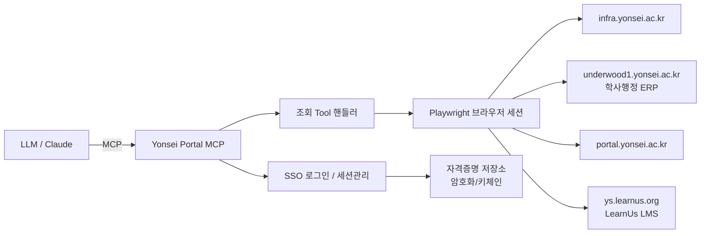

# 설계·조사 기록 보존본

보존일: 2026-09-25. 아래는 문서 정리 이전 설계 전문입니다.
2026-05~06의 초기 조사와 2026-09의 보강 기록이 함께 있으며, 절 번호와 내용은 추적 목적으로 유지합니다.

**현재 계약이 아닙니다.** 오래된 도구 수·가상 도구명·쿠키 경로·쓰기 계획·미지원 입력이 포함돼 있습니다.
`✅`는 당시 메뉴 확인만 뜻할 수 있고, 실측 숫자는 현재 값이 아닙니다.
초기 WebSquare 표기, 레이트리밋·암호화·`confirm_token` 계획은 실제 현재 구현으로 해석하지 않습니다.

현재 기준: [DESIGN.md](../../DESIGN.md) · 사용법: [README.md](../../README.md) · 변경 기록: [CHANGELOG.md](../../CHANGELOG.md).
보존 이후 변경은 현재 문서에서 관리하며, 아래 체크리스트를 다시 실행하거나 완료 목록으로 사용하지 않습니다.

---

## 0. 현재 구현 상태 (2026-09-25)

이 절은 현재 코드와 실접속 검증 기준입니다. 아래 2026-05~06 조사 기록의
`✅`는 조회 가능/구현 후보를 뜻하는 경우가 있으므로 **현재 구현 완료 표시로
해석하지 않습니다**. 포털 메뉴 존재와 MCP 구현·검증 여부를 구분합니다.

| 영역 | 현재 구현 | 검증/한계 |
| --- | --- | --- |
| ERP (6개) | 프로필, 수강신청내역 기반 시간표, 전체성적, 수강편람, 시험일정, 장학수혜내역 | 연/학기 성적 및 중간/기말 필터 지원. 프로필 이름·학번 기본 제외 |
| LearnUs (14개) | 강좌, 마감, 공지 목록/검색/본문, 출석, 강의자료, 종합요약, 과제 목록/상태, 과거강좌, 성적부, 게시판/글 목록 | 한국어 수집 고정. 과제·성적부·게시판 DOM 대조. 제출물/게시판 본문 제외, 성적 피드백 기본 제외 |
| 도서관 (9개) | 개인 대출/도서 예약 및 이전 이력, 공개 좌석 집계, 열람실 좌석, 도서 검색/복본 상세, 일반공지 | stdio 실접속 통과. 검색·복본·공지는 무로그인 HTTP. 이력은 표시 페이지 한정 |
| 일정 (4개) | 마감일·도서 반납일 ICS, 통합 일정, 명시적 반복 시간표 ICS, 공식 학사일정 | 자동 교시 추정 없음. 공개 학사일정의 원문 날짜·월별 목록 보존 |

### 2026-09-25 조회 확장과 실측 제한

- 모든 LearnUs 조회는 공통 `_goto_korean`으로 `lang=ko`를 중복 없이 설정하고 실제
  DOM 언어를 확인합니다. 리다이렉트가 lang을 소비해도 강좌/과제/게시판 ID 검증은 유지합니다.
  실제 영어 화면에서 시작해 한국어로 전환되는 것을 검증했습니다. §12 L0 완료이며 L1/L2는 미구현입니다.
- `get_lms_boards(course_id)`와 `get_lms_board_posts(board_id)`를 추가했습니다.
  게시판 표의 이름·표시 글 수·갱신시각과 글 목록의 제목·날짜·링크만 반환합니다.
  작성자·게시글 본문·첨부파일·링크 없는 제목은 제외하고 숨김 요소도 제거합니다.
  첫 표시 페이지만 수집하고 `unlinked_count`/`has_pagination`으로 제한을 알립니다.
  현재 강좌 3개와 과거 강좌 4개 게시판, 공개 링크 글 2개 및 링크 없는 글 2개를 원문 대조했습니다.
- 두 도서관 이력 도구에 추가했던 날짜·페이지 옵션은 실검증을 완료하지 못해 공개 MCP
  입력에서 제거했습니다. 인자 없는 기본 조회만 지원하고 캐시는 계정별입니다. 내부 원문
  링크 기반 페이지 탐색과 날짜 검증은 후속 조사용 코드이며 공개 지원을 의미하지 않습니다.
- 실제 날짜 검색 버튼의 GET `/myloan/history` 요청에 `dtf`/`dtt`(YYYYMMDD), `pn`이
  포함되는 것을 확인했습니다. 별도 데이터 XHR 없이 HTTP 200의 원본 HTML이 날짜를
  돌려주지 않았고 대출 결과도 0건이라 필터 적용 여부를 판별할 수 없었습니다. 서버가 필터를
  무시한다거나 날짜값 미반환이 곧 서버 결함이라고 단정하지 않습니다. 원인 미확정입니다.
  기본 이력은 대출 0건·예약 1건이며 두 화면 모두 2페이지 링크가 없었습니다. 실제 후속
  페이지 표본 없이 합성 테스트만으로 지원 완료를 주장하지 않습니다.
- LearnUs 과거강좌는 연도·학기 선택 상태와 각 행의 조건을 검증합니다. 전체 10건과
  전체연도 학기별 합집합(1학기 6/여름 0/2학기 4/겨울 0)이 일치했고 2026년 학기별,
  2025년 전체(0건)도 원본 부분집합과 일치했습니다. 숨은 페이지 제어와 중복 ID는 없었습니다.
  현재 강좌 6개 중 4개가 이력에 포함됐고 나머지 2개는 비교과였습니다. 이는 현재 계정의
  표시 결과 간 일치 검증이며 전체 학교 이력 완전성의 증명이 아닙니다.
- 과거강좌 공개 입력은 year/semester만 제공합니다. 응답은 `scope=displayed_result`,
  `filters_verified=true`, `pagination_supported=false`, `has_next=null`로 표시합니다.
  page=1 응답은 내부 호환값이지 필요한 입력이나 전체 수집 완료 표시가 아닙니다.
- FastMCP가 알 수 없는 인자를 무시하는 동작을 확인하여 세 이력 도구는 추가 인자를
  스키마·실제 호출에서 거절하도록 했습니다. 날짜·페이지가 무시된 기본 결과를 필터 결과로
  오인하지 않도록 로그인 전에 차단하고, 잘못된 입력값은 검증 오류문에서 제외합니다.
- 쓰기·UI·게시판 본문·전체 이력 자동 수집은 이번 범위에서 제외합니다. 총 도구는 33개입니다.

### 코드 리뷰 후 정확성·안전장치 보강

- 계정 ID 해시와 LearnUs/도서관/ERP별 디렉터리로 쿠키를 격리합니다. 기존 공용 쿠키는
  자동 이관하지 않고 새로 인증합니다. 캐시 조회와 세션 진입 전에 현재 설정이 열린 세션과
  일치하는지 검사하며, 실행 중 설정이 바뀌면 서버 재시작을 요구합니다.
- 환경변수 우선순위를 통일했습니다. 명시적인 실접속 비활성화가 설정 파일 로딩으로
  덮어써지지 않습니다. 실제 LLM 초기화도 실접속 게이트 이후에 수행합니다.
- LearnUs 마감·출석·자료는 최종 URL/ID와 DOM 준비를 검사합니다. 빈 달력의 실측 표식은
  `.maincalendar .eventlist .calendar-no-results`의 `계획된 일정이 없습니다.`입니다.
  출석은 `progress.php`에서 실측한 `user_progress_a.php` 이동을 같은 ID일 때만 허용합니다.
  강좌 섹션이 아직 없는 자료 화면은 0건으로 확정하지 않습니다. 과제 상태는 중첩된 제출물
  표를 제외하고 최종 과제 ID를 확인합니다. 공지의 숫자 날짜도 달력 유효성 검사를 거칩니다.
- ERP 시간표는 데이터셋 누락/손상과 명시적인 빈 목록을 구분합니다. 소수 학점은 Decimal로
  합산하고 JSON 숫자로 손실 없이 반환합니다. 범위·격주 등 미지원 교시 표현은 부분 해석하지
  않습니다. 원문을 보존하고 반복 ICS는 미지원 표현을 거절합니다.
- 마감 ICS의 `DTSTART==DTEND`를 제거하고 순간 이벤트로 내보냅니다. 날짜만 있는 값을
  자정으로 만들지 않으며 UTC 타임스탬프와 URI 인코딩을 바로잡았습니다.
- LLM 하니스는 잘못된 인자 JSON/객체가 아닌 인자와 중단된 응답을 거절합니다. 시나리오에
  실제 필터 인자 검사를 추가하고 성적 필터는 원본의 일치 행 전체와 대조합니다. 민감한
  답변·인자·대화는 객체 repr 및 실패 진단에서 제외합니다. 의도적인 데모 답변 출력은 유지합니다.
- 회귀 검증은 합성 실패 재현 후 수정, 네트워크 차단 로컬 Chromium DOM 테스트,
  전체 오프라인 테스트, 33개 도구 실접속 및 원문 대조 순서로 수행합니다.

### 기능 확장 상세

- `get_lms_gradebook(course_id,include_feedback=False)`: 고정된 성적부 경로의
  `table.user-grade`에서 분류/항목/소계·총계를 구분합니다. 성적·가중치·범위·백분율·
  총점 기여도를 표시된 경우 원문으로 보존하며 미표시 점수를 0으로 추정하지 않습니다.
  피드백은 opt-in이며 내부 사용자 속성·숨김 설명은 제외합니다. 중첩 피드백 표를
  성적 행으로 오인하지 않습니다. 현재 10행/과거 8행의 모든 표시 열을 DOM과 대조했고
  0점·숨김·선택 열·중첩 표는 합성 테스트로 검증했습니다. ERP 확정 성적과 별개입니다.
- `get_library_book_detail(catalog_id)`: 공개 `/search/detail/CATTOT<숫자>` 경로를
  HTTP로 읽습니다. 복본별 등록번호·청구기호·소장처·도서상태·원문 반납예정일만
  반환하고 예약 버튼은 무시합니다. 실제 복본 1개의 모든 필드를 무로그인 브라우저와
  대조했습니다. 빈 반납일은 빈 값으로 유지하며 확인하지 않은 ID 형식은 거절합니다.
- `get_my_loan_history()`와 `get_my_reservation_history()`: 각각 `/myloan/history`,
  `/myreserve/integratedhistory`의 본인 도서 표만 읽습니다. `scope=displayed_page`,
  `has_pagination`과 대출 날짜 필터 원문을 반환합니다. 미검증 옵션 철회와 실측 제한은 위 절을
  따르며 반환 count는 전체 이력이 아닙니다. 대출은 현재 필터의 명시적 0건,
  예약은 실제 과거 이력 1행의 모든 필드를 대조했습니다. 비어 있지 않은 대출 행은
  합성 테스트로 검증합니다. 반납일은 반납예정일과 구분하고 취소 폼은 제출하지 않습니다.
- 신규 네 도구는 출처·수집시각과 5분 캐시를 제공합니다. 성적부는 계정·강좌·피드백
  옵션별, 공개 이력은 계정별, 공개 복본은 자료 ID별 키를 사용합니다. 전체 등록 도구는 33개입니다.
- `export_timetable_ics(start_date,end_date,period_times,exclude_dates?)`: 반복 시간표는
  사용자 확인 기간·교시별 KST 시각을 필수로 받습니다. RRULE/UNTIL/EXDATE를 사용하고
  실제 교시 누락·해석 불가능한 시간·중복 일정은 오류로 처리합니다. 합성 시각으로
  실제 시간표 슬롯 수를 검증했으며 별도 iCalendar 파서로 DTSTART/DTEND/RRULE/EXDATE를
  확인했습니다. 이는 학교 공식 교시 시각 검증이 아닙니다. 공휴일/휴강 자동 제외 없음.
- `get_academic_calendar()`: 공식 홈페이지 `/sc/373/subview.do`의 현재 표시 학기를
  조회합니다. `input#year/#half`, `#timeTableList .box-sch`를 검증하고 월별 항목의
  날짜 원문과 제목을 보존합니다. 2026-2학기의 7개월·51개 표시 항목을 브라우저와
  대조했습니다. 월 경계 항목은 인접 월에 반복되며 실제 시작일을 추정하지 않습니다.
- 수강편람에 `year`, `term_code`, `campus_code` 선택 인자를 추가했습니다.
  s1/s3/s7(신촌 학부/대학원/의료원), s2/s4/s8(미래) 선택을 원문 코드로 확인합니다.
  연도 입력은 키 입력으로 반영하고 이전 연도 초기화 응답을 배제합니다. 실제 요청
  조건과 결과 행을 확인하며 200건 상한 이후 로컬 필터가 0건이어도 전체 0건으로
  오인하지 않도록 matching_count/truncated를 제공합니다. 학교 대기열은 우회하지 않습니다.
- 열람실의 운영 중 표기 `좌석배정`과 `FULL`을 추가 지원합니다. 이전에 실측된
  배정가능/배정불가와 구분하며 네 상태 외에는 임의로 배정가능으로 판단하지 않습니다.
- `get_lms_assignment_status(assignment_id)`: 과제 링크의 숫자 id로 본인 제출 상태를
  조회합니다. 실제 과거 과제의 `제출 여부`, `채점 상황`, `종료 일시`를 DOM과
  대조했습니다. 미제출과 채점됨이 함께 있을 수 있어 독립적으로 반환합니다.
  알려진 상태만 정규화하고 그 밖에는 unknown, 확인한 날짜 형식만 KST ISO로
  변환하며 원문을 보존합니다. 제출물 설명·첨부파일은 반환하지 않습니다.
  완료/초안 상태의 실제 표본은 현재 계정에서 미확인으로 합성 테스트를 사용합니다.
- 성적 파서의 데이터셋 역매핑 수정: `dsSgra100`=과목, `dsSgra120`=학기.
  과목 학점 `cmpsjCdt`, 표시성적 `gradeDivCdView`, 누적학점/GPA
  `dsStdntInfo.acqsCdt/bwa`를 사용합니다. 실제 5개 과목과 누적 요약을 원문과 대조했습니다.
  `get_grades(year?,term_code?)`로 과목·학기 목록을 필터하되 summary_scope=all_terms는
  항상 누적 범위입니다. 0값을 결측으로 바꾸지 않습니다.
- `get_my_schedule(days=7,include_loans=True,include_exams=False)`: KST 오늘부터
  1~90일 기간의 마감/반납일, 날짜 미상 항목, 주간 시간표를 구분합니다.
  선택적 시험 조회는 중간/기말을 각각 실행하며 날짜 범위 밖 항목도 포함할 수 있습니다.
  휴강·교시 실시간·학기 경계는 추정하지 않습니다. generated_at은 묶음 생성시각이며
  개별 소스 캐시의 원천 갱신시각이 아닙니다.
- 세션 재시도 전체에 잠금을 유지하고 시작 실패/무효화/종료 때 context·browser·
  Playwright를 모두 정리합니다. FastMCP lifespan 종료에서 생성된 세션과 캐시를 닫습니다.
  일반 브라우저 예외 원문은 외부 응답에서 제외합니다. 동시 close/조회와 재시도를 테스트합니다.
- `get_student_profile(include_pii=False)`: 이름·학번을 기본 제외하며 명시적으로
  True일 때만 포함합니다. 캐시 원본을 변경하지 않고 응답마다 필터링합니다.
- `search_courses(keyword,limit=20)`: 수강편람의 교과목명 검색 UI와 학교 대기열을
  거쳐 `findAtnlcHandbList.do`/`dsSles251`을 읽습니다. `@d1#kwd`, `searchGbn=2`,
  `kwdDivCd=2`를 검증하며 실제 검색 결과 과목명 일치도 확인했습니다. 화면 기본
  필터를 공개하고, 200건 상한 또는 반환 limit에 걸리면 `truncated=true`입니다.
- `get_exam_schedule()`: 학기/조회기간 초기화 완료 후 조회 버튼을 눌러
  `findExamTimtbList.do`/`dsSles450`만 기다립니다. 현재 계정의 조회기간 미등록·0건
  응답을 확인했으며 `period_configured=false`와 안내를 반환합니다.
  exam_type=default/midterm/final로 선택하며 두 시험구분을 실제 화면에서 확인했습니다.
  비어 있지 않은 데이터는 화면의 `.clx.js` 정의와 합성 테스트 기준입니다.
- `get_scholarship_history()`: `findStdntRecfvDtlsList.do`/`dsSscl121`,
  연도·학기코드·장학명·금액·원문지급일만 허용합니다. 현재 계정은 정상 0건이며
  실제 지급 행은 아직 미확인입니다. 학번·내부 레코드 번호를 제외합니다.
- `get_lms_course_history(year?,semester=all)`: 과거강좌조회 표에서 강좌 링크·연도·
  학기를 수집합니다. 전체 조회와 명시적 빈 학기를 실측했습니다. 전체 조회에는
  현재 강좌가 포함될 수 있으며 페이지네이션 여부를 반환합니다.
- `get_my_reservations()`: `/myreserve/integratedList`의 도서예약 표를 읽습니다.
  실제 3개 예약 행의 모든 반환 필드를 브라우저 원문과 메모리에서 대조했습니다.
  좌석·시설 예약이나 대출연장·취소는 포함하지 않습니다.
- 열람실의 `합계` 행을 방으로 집계하던 오류를 수정했습니다. 이전의 28개/3300석은
  합계 중복 결과였으며 해당 시점의 실제 원문은 27개/1650석입니다. 표의 모든
  숫자와 원문 합계를 검증하며 배정불가 방을 제외한 `assignable_available`을 별도로
  제공합니다. 해당 시점에는 모두 배정불가여서 이 값은 0입니다. 이 수치는 예시
  스냅샷이며 현재 값으로 사용하지 않습니다. 공개 집계와 범위/갱신 차이가 있으므로
  서로 합치지 않고 출처·수집시각을 함께 반환합니다.
- 대출/예약은 정확한 헤더와 명시적 빈 표식만 허용합니다. 좌석 숫자 누락·로그인
  화면·스키마 변경을 0으로 감추지 않습니다. 라이브 테스트는 같은 스냅샷에서
  브라우저 DOM/공개 JSON을 별도로 읽어 반환 필드와 대조합니다.
- `get_lms_assignments(course_id)`: 기존 강의자료 캐시에서 `type=assign`만 추출.
  `course_id`, `count`, `assignments[{title,url,week,section}]`을 반환합니다.
  마감·제출 상태를 추정하지 않으며 동영상·퀴즈와 구분합니다.
- `search_library_books(query,page=1,limit=10)`: 공개 GET `/search/tot/result`.
  HTTP + Beautiful Soup으로 서지정보·원문 링크·표시된 소장/대출 상태를 수집합니다.
  입력은 1~200자, 페이지 1~100, 반환 최대 10건이며 실제 0건 표식을 확인합니다.
- `get_library_notices(limit=10)`: 공개 GET `/bbs/list/1`, 첫 페이지 최대 20건.
  원문 순서(고정 공지 포함)를 유지하고 제목·날짜·링크만 반환합니다.
- 기존 `get_notice(url)`도 도서관 일반공지 `/bbs/content/1_<id>`를 지원합니다.
  제목·날짜·본문 텍스트만 읽고 작성자는 제외합니다. `image_count`와 `note`로
  이미지 내용이 추출되지 않았음을 알립니다. 로그인 전 HTTPS/호스트/경로를 검증합니다.
- 두 공개 HTTP 도구는 기존 TLS 체인을 검증하며, 같은 호스트·포트의 HTTPS
  리다이렉트만 최대 5회 요청합니다. 작성자·인증 쿠키를 수집하지 않습니다.
  목록 결과 캐시는 5분(본문 30분)이고 HTTP/파싱 실패는 빈 결과로 감추지 않습니다.
  실측된 관리자 삭제 공지 행은 제외하되 불명확하게 손상된 행은 오류로 처리합니다.
- 기본 pytest는 전체 `test_*.py`를 수집합니다. `tests/test_live_tools.py`는
  `RUN_LIVE_PORTAL=1`일 때만 실제 서버의 등록 도구 전체를 호출하고 스키마 및
  MCP `isError`를 확인합니다. 응답 원문은 로그에 출력하지 않습니다.

### 미구현/미검증과 제외

| 항목 | 상태와 다음 확인 |
| --- | --- |
| 강의계획서 | 수강편람 버튼의 리포트 `.crf` 경로 확인. 접근 가능한 버튼 렌더/본문 추출은 미확인. 과목명 목록을 계획서로 대체하지 않음 |
| ERP 학적 공지 | `학적 → 공지사항조회` 메뉴 확인. 지도교수 관련 게시판이며 현재 지도교수 선택 목록 0명으로 글 목록 미검증. 기존 '메뉴 없음' 판정 정정 |
| 장학 공고 | 미구현. 장학수혜내역과 신청가능 공고는 별개 |
| 대출/예약 이력 확장 | 날짜·페이지 옵션은 실검증 미완료로 공개 입력에서 철회. 날짜 적용 원인 미확정, 실제 2페이지·비어 있지 않은 대출 행 표본 없음. 기본 조회만 제공 |
| 강좌 게시판 추가 범위 | 게시판·글 목록 첫 페이지 구현. 본문·첨부파일·후속 페이지는 미구현 |
| 시설/좌석 본인 예약내역 | `libadm /fac`의 날짜·그룹·시설 선택 화면 확인. 본인 예약내역 목록/응답 미확인. 예약 제출은 하지 않음 |
| 학부 졸업요건·메일·전자출결 조회 | 현재 계정/시스템별 접근 추가 확인 필요 |
| 공식 교시/학기 경계 자동 연결·다국어 | 미구현. 반복 ICS는 사용자 확인 입력으로만 동작. 공개 일반 학사일정을 개인 수업기간으로 단정하지 않음 |
| 개인정보 최소화 범위 | 프로필 이름·학번 제외 구현. 성적/대출/과제 상태 자체는 여전히 개인정보이며 외부 LLM 전달에 주의 |
| 배포 | wheel/uv 패키징 구현. PyPI 공개 게시 상태는 이번 검증 범위 아님 |
| 대출연장·예약 생성/취소·신청·제출 | 이번 구현 제외. 도서예약 조회만 지원. 실제 쓰기 실행 전 별도 확인 필수; §11.4 제한 유지 |

### 후속 조회 후보 실탐색 (2026-09-22, 조사 및 후속 구현)

Playwright의 기존 세션 계층으로 LearnUs·도서관·ERP 각각 인증 성공을 확인했습니다.
아래는 실제 메뉴/응답을 근거로 한 조사 기록이며 후속 구현 여부를 마지막 열에 표시합니다.
민감한 값 대신 표 헤더·행 수·API 필드 이름만 기록했으며 신청·예약·취소·제출은 하지 않았습니다.

| 후보 | 실제 확인한 경로/결과 | 후속 구현/남은 검증 |
| --- | --- | --- |
| 강좌별 LMS 성적부 | 강좌의 성적부 링크 `/grade/report/user/index.php`. 현재/과거 각 1개 강좌의 성적 항목·가중치·성적·피드백 열 확인 | 구현 및 표시 열 대조 완료. 항목/분류/총계 구분, 피드백 opt-in, ERP 확정 성적과 구분 |
| 도서 복본 상세 | 소장자료 검색 결과의 실제 상세 링크. `table.searchTable`의 복본 정보 확인 | 구현 및 복본별 모든 반환 필드 대조 완료. 예약 버튼은 누르지 않음 |
| 이전 도서 예약 이력 | `/myreserve/integratedhistory` 첫 도서예약 표에 실제 데이터 1행 | 표시 페이지 조회 구현·원문 대조. 현재 예약/다른 신청 표와 분리. 전체 페이지 수집 미지원 |
| 이전 대출 기록 | `/myloan/history`의 대출일·반납일·반납유형 열과 현재 필터의 명시적 빈 결과 확인 | 표시 페이지 조회 구현. 비어 있지 않은 행은 합성 검증. 기간 변경·전체 이력 수집 미지원 |
| 강좌별 게시판 목록/글 목록 | `/mod/ubboard/index.php`와 `/mod/ubboard/view.php`. 2026-09-25 현재 3개·과거 4개 게시판, 공개 링크 2개와 링크 없는 글 2개 확인 | 목록 구현·원문 대조 완료. 작성자·본문·링크 없는 글 제목 제외. 후속 페이지/본문 미수집 |
| 지도교수 관련 공지 | `학적 → 공지사항조회` 화면과 `ssrmcn0010_div11.clx.js` 확인. `findItrvwAcdadComboList.do`가 `dsAcdadEmpno=[]` 반환 | 선택 가능한 지도교수가 없어 `findItrvwBoardList.do` 실제 응답 미확인. 임의 교수 ID를 넣거나 전체 학교 공지로 간주하지 않음 |
| 강의평가 결과 | `수업 → 강의평가결과조회` 메뉴와 학기 초기화 JSON 확인 | 조회 결과 데이터는 대기 실패로 미검증. 강의평가 제출과 다른 읽기 메뉴지만 구현 가능 확정으로 분류하지 않음 |
| 시설 조회 | 인증된 좌석 시스템에서 `/fac` 화면 진입 성공, 날짜·도서관 선택·그룹·시설·사용시간 표 확인 | 본인 예약내역 메뉴/데이터 미확인. 이동 중 일시적 실패도 관찰됐으므로 최종 화면 도착과 데이터 준비 검증 필요 |

승인한 순서인 **LMS 성적부 → 도서 복본 상세 → 대출/예약 이력**까지 구현했습니다.
2026-09-25에 강좌 게시판·글 목록 첫 페이지 조회도 구현했습니다.
나머지는 메뉴 존재만으로 정상 데이터 접근이나 구현 완료를 주장하지 않습니다.

## 1. 개요

| 항목 | 내용 |
|------|------|
| 목적 | 포털 학사 데이터를 LLM이 호출 가능한 도구(tool)로 노출 |
| 1차 범위 | **조회 전용** (성적/시간표/학적/공지/수강편람 등) |
| 후순위 | 변경(신청·제출·예약·발급) 기능 |
| 자동화 방식 | Playwright 헤드리스 브라우저 (SPA + SSO + iframe 구조 대응) |

---

## 2. 인증 / 시스템 구조 (실탐색 확인)

### 2.1 로그인 흐름 (검증 완료 ✅)
```
portal.yonsei.ac.kr (SPA)
  └─ 유틸메뉴 > 로그인
       └─ infra.yonsei.ac.kr/sso/PmSSOService  (통합인증 SSO)
            · ID/PW 입력 (학번 + 비밀번호)
            · reCAPTCHA 스크립트 로드되나 이번 로그인은 추가 인증 없이 통과
            · (정책상) Google OTP 2차 인증이 요구될 수 있음
       └─ portal.yonsei.ac.kr/portal/MainCtr/index.do  (로그인 후 메인, iframe 내부 렌더)
```

> **주의**: 메인 포털 화면은 **iframe** 안에 그려지고, 학사행정은 **별도 도메인**으로 SSO 연계된다.
> 따라서 단순 HTTP 요청이 아니라 **실제 브라우저 세션**이 필요하다.

### 2.2 핵심 백엔드 시스템
| 시스템 | 도메인 | 성격 | UI 특성 |
|--------|--------|------|---------|
| 통합인증(SSO) | `infra.yonsei.ac.kr` | 로그인 | 폼 입력 |
| 포털 메인 | `portal.yonsei.ac.kr` | 대시보드/링크 허브 | SPA + **2중 iframe**(`/ui/thirdparty/portal/main.jsp`) |
| **학사행정(ERP)** | `underwood1.yonsei.ac.kr` | **핵심 조회/신청** | iframe + **탭형 MDI**, 좌측 메뉴 트리 |
| **온라인강의(LMS)** | `ys.learnus.org` (Moodle) | **강의/과제/출석/공지/시간표** | 표준 Moodle, 자체 SSO |
| 전자출결 | `ysrollbook.yonsei.ac.kr` | 오프라인 출석(QR/비콘) | 별도 |
| 웹메일 | `mail.yonsei.ac.kr` | 메일 | 별도 |
| 인터넷증명서 | `icert.yonsei.ac.kr` | 증명서 발급(결제/출력) | 별도 |
| IT서비스(신촌/미래) | `yis/ywis.yonsei.ac.kr` | IT 헬프데스크 | 별도 |
| 통학버스/셔틀 | `ysbusticket.yonsei.ac.kr` / ERP | 승차권·예약 | 별도 |

> **포털 링크 동작**: 메인의 각 서비스 링크는 `href="#"` + JS 매핑(`LKxxx` 클래스)으로 `window.open(도메인)` 하는 구조.
> 즉 포털은 **링크 허브**일 뿐 실제 데이터는 위 개별 도메인에 있으며, **각 시스템마다 SSO 로그인이 별도로 필요**하다(동일 자격증명).

### 2.3 학사행정(ERP) UI 동작 방식 — MCP 구현 핵심
- 좌측 **카테고리 탭**(학적·수업·성적·졸업·등록·장학·학생지원·국제학생교류·셔틀버스·기숙사·학사기타)
- 각 카테고리 클릭 → 하위 **메뉴 버튼** 노출 → 클릭 시 우측 **탭(MDI)** 으로 화면 로드
- 데이터는 DOM의 테이블/영역(`region`, `table`)으로 렌더 → **Playwright 셀렉터로 스크래핑 가능**
- 세션 만료 타이머(60분) 존재 → 장시간 유휴 시 재로그인 필요

### 2.4 LearnUs(LMS) 실제 SSO 로그인 흐름 (검증 완료 ✅ 2026-05-30)

> 포털(`portal.yonsei.ac.kr`) 로그인과 **별개로** LearnUs는 자체 SSO 진입점을 가진다.
> 헤드리스 스모크 테스트로 아래 단계·셀렉터를 실측했다(현재 구현이 사용하는 경로).

```
ys.learnus.org (Moodle 로그인 페이지)
  └─ a.btn-sso ("연세포털 로그인") 실제 클릭   ← SSO URL 직접 접근 시 403
       └─ passni/sso/spLogin2.php (중간 리다이렉트)
            └─ infra.yonsei.ac.kr/sso/PmSSOService  (통합인증 폼)
                 · #loginId(학번) / #loginPasswd(비밀번호)
                 · form#ssoLoginForm → action=PmSSOAuthService
                 · 숨김필드: retUrl/failUrl/app_id/captcha_yn/E2~E4/ssoGubun ...
                 · 제출은 페이지 자체 JS 함수 fSubmitSSOLoginForm() 호출
       └─ infra PmSSOAuthService (인증 POST)
            └─ ys.learnus.org/passni/sso/spLoginData.php (중간 랜딩)
                 · ~1.5s 후 JS로 대시보드 리다이렉트
       └─ ys.learnus.org/ (대시보드, 로그인 완료)
```

**인증 성공 판정**: `a[href*="/login/logout.php"]`(로그아웃 링크) 존재 여부.
spLoginData.php 시점엔 아직 없으므로 **로그아웃 링크가 나타날 때까지 대기**해야 한다.

**실측 함정(회귀 방지용 기록)**
- btn-sso 클릭을 단일 `expect_navigation`으로 감싸면 다단계 리다이렉트와 경합해 실패 → **클릭 후 `#loginId` 셀렉터 대기** 방식이 안정적.
- 캡차(`captcha_yn`)는 이번 검증에선 미발동. 정책 변경 시 발동 가능 → **헤드드(headed) 모드 폴백** 필요.
- 자격증명 오류 시 PmSSOAuthService가 리다이렉트 없이 "아이디 혹은 비밀번호가 일치하지 않습니다" HTML을 반환 → `AUTH_FAILED`로 식별.
- `.env`의 `YONSEI_ID`가 `ID`보다 우선 → 예시 플레이스홀더가 실값을 덮어쓰지 않도록 주의.

### 2.5 세션 · 재인증 · 동시성 · 오류 처리 (설계 보강)

**세션 캐시(시스템별 분리)**
- `storage_state`를 시스템별로 분리 저장: `.session/learnus.json`, (ERP 구현 시) `.session/erp.json`. 쿠키 도메인이 다르므로 단일 파일로 합치지 않는다.
- 서버 기동 시 캐시가 있으면 로드, 도구 호출 시점에 `ensure_authenticated()`로 유효성 확인.

**재인증 트리거(60분 만료 대응)**
- 매 도구 호출 전 인증 지표(로그아웃 링크/특정 DOM) 확인 → 없으면 자동 재로그인.
- 세션만료 리다이렉트/로그인 페이지 감지 시 **1회 재로그인 후 재시도**, 그래도 실패면 오류 반환.

**동시성**
- 단일 브라우저 컨텍스트를 공유하므로 `asyncio.Lock`으로 페이지 발급을 직렬화(동시 호출이 같은 탭을 침범 방지).
- 시스템(LearnUs/ERP)별 독립 컨텍스트·락.

**오류 규약(도구 반환)** — 표준 코드
| 코드 | 의미 | 처리 |
|------|------|------|
| `AUTH_REQUIRED` | 자격증명 없음 | `.env` 안내 |
| `AUTH_FAILED` | ID/PW 불일치 | 재시도 금지, 사용자 확인 |
| `MFA_REQUIRED` | OTP/캡차 발동 | 헤드드 모드 1회 수동 로그인 유도 |
| `SESSION_EXPIRED` | 세션 만료 | 재로그인 후 자동 재시도(최대 1회) |
| `SCRAPE_FAILED` | 셀렉터 불일치/구조 변경 | 명시적 실패 노출 |
| `UPSTREAM_TIMEOUT` | 네트워크/타임아웃 | 지수 백오프 1~2회 |

> 비밀번호·세션쿠키·PII는 오류 메시지에 **절대 포함하지 않는다.**
> 페이지 이동/셀렉터 대기 타임아웃은 `YONSEI_NAV_TIMEOUT_MS`(기본 30s)로 조정.

---

## 3. 조회(Read) 기능 카탈로그 — 실탐색 기준

> 아래는 학사행정(ERP) 좌측 메뉴를 직접 열어 확인한 목록.
> ✅=조회(1차 구현 대상), ⏳=변경(후순위)

### 📁 학적
| 메뉴 | 유형 | 비고 |
|------|------|------|
| 학적정보조회 | ✅ | 학번/소속/학위과정/학기/학적상태/연락처/학적변동/전공정보 등. **PII 다수 포함** |
| 공지사항조회 | ✅ | 지도교수면담 등 공지 |
| 학적부기재정정신청 / 휴학신청(대학원) | ⏳ | |

### 📁 수업
| 메뉴 | 유형 | 비고 |
|------|------|------|
| 수강편람 | ✅ | 과목 검색(개설과목 카탈로그) |
| 교과목개요출력 | ✅ | 강의계획/개요 |
| 수강신청내역 | ✅ | 현재 신청 과목 |
| **수업시간표조회** | ✅ | 내 시간표 |
| 시험시간표조회 | ✅ | 시험 일정 |
| 강의평가결과조회 | ✅ | |
| 국내학점교류신청 / 학부보충과목수강신청 / 수강철회신청 / 강의평가실시 | ⏳ | |

### 📁 성적
| 메뉴 | 유형 | 비고 |
|------|------|------|
| **성적평가조회** | ✅ | 학기 성적 |
| **전체성적조회** | ✅ | 누적 성적 / GPA |
| 인정학점/대체교과목조회 | ✅ | |
| 인정학점신청류 / [대학원]조기수강학점신청 | ⏳ | |

### 📁 졸업 (대학원 계정 기준)
| 메뉴 | 유형 | 비고 |
|------|------|------|
| 논문제출자격시험이력조회 | ✅ | |
| 논문조회 | ✅ | |
| 논문심사결과조회 | ✅ | |
| 종합시험신청 / 외국어시험신청 / 연구계획서제출 / 논문심사위원등록 / 학위논문인준신청 등 | ⏳ | |

> ℹ️ 학부 계정은 졸업 카테고리에 **졸업사정/졸업요건 이수현황** 류가 있을 것으로 예상(별도 확인 필요).

### 📁 등록
| 메뉴 | 유형 | 비고 |
|------|------|------|
| 등록금고지서출력 / 등록금납부확인서출력 | ✅ | 문서 출력(조회성) |
| 교육비납입증명서출력 / 계절학기고지서출력 | ✅ | |
| 자율경비선택 / 분할납부신청 | ⏳ | |

### 📁 장학
| 메뉴 | 유형 | 비고 |
|------|------|------|
| 장학수혜내역조회 | ✅ | |
| 학생장학신청 / 교내근로 관련 | ⏳ | |

### 📁 셔틀버스 / 기숙사 등
| 메뉴 | 유형 | 비고 |
|------|------|------|
| 셔틀버스예약 | ⏳ | 예약=변경 |
| (기숙사/학생지원/국제학생교류) | - | 대부분 신청 위주, 조회는 별도 확인 |

### 📁 포털 메인 대시보드 (iframe)
| 항목 | 유형 |
|------|------|
| 학사정보 알림 / 신청가능 장학금 / 도서대출 건수 | ✅ |
| Notice(학사/전체 공지 목록 + 더보기) | ⚠️ | 포털 Notice는 **내용이 빈약/오래됨**(예: 2022·2023 항목만). 실제 공지는 ERP 공지사항조회·LearnUs에 있음 |

### 📁 온라인강의(LearnUs, `ys.learnus.org`) — Moodle, **조회 가치 매우 높음**
> 로그인 직접 확인 완료. LLM 학습 어시스턴트 용도로 ERP보다 강력한 소스.

| 항목 | 엔드포인트 | 유형 | 비고 |
|------|-----------|------|------|
| 나의 강좌 목록 | `/` (대시보드) | ✅ | 강좌명/과목코드/교수/**학습률(%)** |
| 강의 시간표 | `/local/timetable/index.php` | ✅ | LearnUs 기준 시간표 |
| **출석현황** | `/report/ubcompletion/progress.php?id={course}` | ✅ | 강좌별 진도/출석 |
| 동영상 학습현황 | 대시보드 위젯 | ✅ | 강의별 영상 시청률 |
| LearnUs 공지사항 | `/mod/ubboard/article.php?id=..&bwid=..` | ✅ | 플랫폼 전체 공지 |
| **진행강좌 공지(과제/마감 안내)** | `/mod/ubboard/my.php` | ✅ | 내 수강과목 공지(예: "딥러닝 실습 안내","최종발표 공지") — **마감/과제 핵심 소스** |
| 강좌 홈(과제·자료) | `/course/view.php?id={course}` | ✅ | 주차별 자료/과제(mod/assign) |
| 달력(마감 일정) | `/calendar/view.php?view=month` | ✅ | 과제/이벤트 마감일 |
| 과거강좌조회 | `/local/ubion/user/index.php` | ✅ | 지난 학기 강좌 |
| 과제 제출 / 토론 작성 | `/mod/assign/...` | ⏳ | write, 후순위 |

---

## 3-bis. 외부 시스템 포함/제외 판정 (전수 조사 결과)

> 포털의 **학사 LINK · Notice · IT SERVICE** 섹션을 모두 열어 실제 도메인을 확인하고 분류함.
> 기준: 조회 가치 높음 + 본인 데이터 + 스크래핑 가능 → 포함 / 신청·결제·발급(write)·지원자용·관리자용 → 제외.

| 구분 | 서비스 | 도메인 | 성격 | 판정 |
|------|--------|--------|------|------|
| 학사LINK | **온라인강의 LearnUs** | `ys.learnus.org` | 강의/과제/출석/공지 조회 | 🟢 **포함(핵심)** |
| 학사LINK | 전자출결 | `ysrollbook.yonsei.ac.kr` | 오프라인 출석(QR/비콘) | 🟡 출석'조회'만 가능 시 포함, 출석체크(write)는 제외 |
| 학사LINK | 학부모서비스 | `yparent.yonsei.ac.kr` | 학부모 전용 | 🔴 제외 |
| 학사LINK | 대학원입학지원 | `yadmis.yonsei.ac.kr` | 입학 지원자용 | 🔴 제외 |
| 학사LINK | Inbound 교환학생 | `yintl.yonsei.ac.kr` | 교환학생 신청 | 🔴 제외 |
| 학사LINK | 학생증발급 | `ysid.yonsei.ac.kr` | 발급 신청(write) | 🔴 제외 |
| IT SVC | 웹메일 | `mail.yonsei.ac.kr` | 메일 | 🟡 Nice-to-have(최근 메일 조회) |
| IT SVC | 인터넷증명서 | `icert.yonsei.ac.kr` | 증명서 발급/결제/출력 | 🔴 제외(write·결제) |
| IT SVC | IT서비스(신촌/미래) | `yis/ywis.yonsei.ac.kr` | IT 헬프데스크 | 🔴 제외 |
| IT SVC | 국제캠 셔틀 | ERP `initExtPageWork?link=shuttle` | 예약 | 🔴 제외(write) |
| IT SVC | 미래 통학버스 | `ysbusticket.yonsei.ac.kr` | 승차권 구매 | 🔴 제외(결제) |
| Notice | 포털 메인 Notice | `portal.yonsei.ac.kr` | 공지 허브 | 🟡 내용 빈약 → ERP/LearnUs 공지로 대체 |

---

## 4. 제안 MCP 도구 (1차 = 조회)

| Tool | 매핑 메뉴 | 우선순위 | 반환 요약 |
|------|-----------|---------|-----------|
| `get_student_profile` | 학적정보조회 | P0 | 소속/학위과정/학기/학적상태 (※ PII 필드 마스킹) |
| `get_my_timetable` | 수업시간표조회 | P0 | 요일/시간/강의실/과목/교수 |
| `get_grades` | 전체성적조회 / 성적평가조회 | P0 | 학기별 성적·학점·GPA |
| `search_courses` | 수강편람 | P0 | 과목/교수/시간/정원 |
| `get_enrollment` | 수강신청내역 | P1 | 현재 신청 과목 |
| `get_exam_schedule` | 시험시간표조회 | P1 | 시험 일정 |
| `list_notices` / `summarize_notice` | 공지사항조회 / 포털 Notice | P0 | 공지 목록 + **LLM 요약** |
| `get_scholarship_history` | 장학수혜내역조회 | P2 | 장학 내역 |
| `get_course_eval` | 강의평가결과조회 | P2 | 강의평가 결과 |
| `get_lms_courses` | LearnUs 대시보드 | P0 | 수강 강좌 + 학습률 |
| `get_lms_deadlines` | LearnUs 진행강좌공지 / 달력 | P0 | **과제·마감·강좌공지**(calendar+board 병합) |
| `get_lms_notices` | LearnUs 공지(전체/강좌/플랫폼) | P0 | 공지 목록(`scope` 필터) |
| `get_lms_attendance` | LearnUs 출석현황 | P1 | 강좌별 진도/출석 |
| `get_lms_course_materials` | LearnUs 강좌 페이지 | P1 | 주차별 학습활동/자료 목록(동영상/파일/과제/게시판) |
| `get_lms_overview` | LearnUs 대시보드 종합 | P0 | 강좌+마감+최근 강좌공지 묶음 |
| `get_webmail_recent` | 웹메일 | P3(nice) | 최근 메일 제목/발신/요약 |
| (후순위) 신청·제출·예약·발급 | ⏳ | 보류 | 부작용 있는 write |

### LLM 활용 시나리오
- "이번 학기 시간표 알려줘" → `get_my_timetable`
- "내 GPA랑 성적 분석" → `get_grades`
- "화요일에 듣는 AI 전공과목 찾아줘" → `search_courses`
- "중요한 학사 공지만 요약" → `list_notices` + `summarize_notice`
- "이번 주 과제·마감 정리해줘" → `get_lms_deadlines`
- "출석/진도 부족한 강의 있어?" → `get_lms_attendance`

### 4-bis. MVP 범위 정리 (티어)

| 티어 | 포함 도구 | 소스 | 목적 |
|------|-----------|------|------|
| **MVP (P0)** | `get_student_profile`, `get_my_timetable`, `get_grades`, `search_courses`, `list_notices`+`summarize_notice`, `get_lms_courses`, `get_lms_deadlines` | ERP + LearnUs | "내 학사 현황 + 과제/마감/공지" 핵심 어시스턴트 |
| **확장 (P1)** | `get_enrollment`, `get_exam_schedule`, `get_lms_attendance` | ERP + LearnUs | 일정/출석 보강 |
| **부가 (P2–P3)** | `get_scholarship_history`, `get_course_eval`, `get_webmail_recent` | ERP + 웹메일 | nice-to-have |
| **제외/후순위** | 신청·제출·예약·발급·결제(전자출결 체크, 증명서 발급, 셔틀 예약, 과제 제출 등) | - | write·부작용, 1차 범위 외 |

> **MVP 한 줄 정의**: *연세포털 + LearnUs를 읽어 "내 시간표·성적·학적·과제/마감·공지"를 LLM이 조회·요약하는 read-only MCP.*
> 석사과정 계정 기준으로 검증했으며, 학부 전용 메뉴(수강신청·졸업사정 등)는 계정 권한에 따라 접근이 제한될 수 있음.

### 4-ter. 도구 계약 · 데이터 모델 (스키마)

> 모든 시각은 **KST(Asia/Seoul) ISO8601**. 빈 결과는 빈 배열 `[]`(에러 아님).
> 상대 표현("이번 주")은 서버가 현재 KST 날짜 기준으로 계산해 반환한다.

**공통 규칙**
- 입력 검증은 시스템 경계에서만(잘못된 enum은 안전 기본값으로 보정).
- 출력 키는 안정 유지, 신규 필드는 추가만(키 제거/의미 변경은 호환성 깨짐).
- **읽기 전용 보장**: 스크래퍼는 로그인 외 폼 제출/상태 변경 호출을 하지 않는다.

**데이터 모델**

| 모델 | 필드 |
|------|------|
| `Course` | `id`(str), `name`, `code`(nullable), `professor`(nullable), `category`, `progress_percent`(float), `url`, `attendance_url` |
| `Deadline` | `title`, `due`(ISO/KST), `due_text`(원문), `course_id`, `course`, `url`, `source`("calendar"\|"board") |
| `Notice` | `type`("course"\|"platform"), `course`(nullable), `date`(YYYY-MM-DD), `title`, `url` |
| `AttendanceTable` | `course_id`, `header`(str[]), `weeks`(dict[]) |
| `CourseMaterials` | `course_id`, `section_count`(int), `activity_count`(int), `sections`(`Section[]`) |
| `Section` | `id`(str), `week`(int\|null), `name`, `activities`(`Activity[]`) |
| `Activity` | `type`(Moodle 모듈: vod/ubfile/assign/ubboard 등), `title`, `url`(nullable) |
| `Grade` (P0·ERP) | `term`, `code`, `name`, `credit`, `grade`, `gpa_point` + 요약 `gpa`/`earned_credits` |
| `TimetableEntry` (P0·ERP) | `day`, `start`, `end`, `room`, `code`, `name`, `professor` |
| `CourseCatalogItem` (P0·ERP) | `code`, `name`, `professor`, `time`, `room`, `capacity`, `enrolled` |
| `StudentProfile` (P0·ERP) | `affiliation`, `degree`, `term`, `status`, `major` (※ PII 필드 마스킹) |

**도구 시그니처(요약)**

| Tool | 입력 | 출력 |
|------|------|------|
| `get_lms_courses` | – | `Course[]` |
| `get_lms_deadlines` | `course_id?` | `Deadline[]` (calendar+board 병합, `url` 기준 중복제거, `due` 오름차순) |
| `get_lms_notices` | `scope`="all"\|"course"\|"platform" | `Notice[]` |
| `get_lms_attendance` | `course_id`(필수) | `AttendanceTable` |
| `get_lms_course_materials` | `course_id`(필수) | `CourseMaterials` (주차 순 정렬, 강의 개요=week null 먼저) |
| `get_lms_overview` | – | `{courses, upcoming_deadlines, recent_course_notices}` |
| `get_my_timetable` (ERP) | `term?` | `TimetableEntry[]` |
| `get_grades` (ERP) | `term?` | `{summary, items: Grade[]}` |
| `search_courses` (ERP) | `keyword`, `term?`, `day?` | `CourseCatalogItem[]` |
| `get_student_profile` (ERP) | `include_pii?`=false | `StudentProfile` (기본 마스킹) |
| `list_notices` (ERP/포털) | `source?`, `limit?` | `Notice[]` |
| `get_notice` (본문) | `url`\|`id` | `{title, date, body_text, attachments}` |

> `summarize_notice`는 **별도 LLM 작업**이며, MCP 도구는 본문을 제공하는 `get_notice`까지만 담당한다(도구가 직접 요약하지 않음).

---

## 5. 아키텍처



- **언어 후보**: Python(`mcp` SDK) 또는 TypeScript(`@modelcontextprotocol/sdk`)
- **브라우저**: Playwright(Chromium). 최초 로그인 1회 → `storage_state`(쿠키) 캐시 재사용
- **ERP 탐색 패턴**: 카테고리 버튼 클릭 → 메뉴 버튼 클릭 → MDI 탭 로드 → 테이블 파싱

### 5.1 성능 · 캐싱 · 레이트리밋 (설계 보강)
- 브라우저 스크래핑은 호출당 수 초가 걸리므로 **결과 캐시(TTL)** 를 둔다. 캐시 키는 (도구, 인자, 계정).
  - 저빈도 변경(시간표/성적/프로필): 길게(예: 30~60분)
  - 고빈도 변경(마감/공지): 짧게(예: 5분)
- 동일 학교 서버에 대한 **연속 호출 간 최소 간격 + 동시성 1**로 과호출을 방지한다.
- `storage_state` 재사용으로 로그인 횟수를 최소화한다.

---

## 6. 보안 고려사항 ⚠️

1. **자격증명**: `.env` 평문 저장은 위험 → `.gitignore` 처리 완료. 가능 시 OS 키체인/암호화.
2. **PII 노출**: 학적정보조회 등에 **주민등록번호·연락처·주소·계좌**가 포함됨.
   → 도구 반환 시 **민감 필드는 기본 마스킹/제외**, 필요한 경우에만 명시적 옵트인.
   - **기본 제외/마스킹**: 주민등록번호, 휴대전화/집전화, 주소, 이메일(부분), 계좌번호, 사진, 비상연락처.
   - **노출 허용(저민감)**: 소속/학과, 학위과정, 학기, 학적상태, 전공.
   - **방식**: 완전제외(주민번호/계좌) 또는 부분마스킹(전화 `010-****-1234`). 해제는 도구 파라미터 `include_pii=true`로 **명시적 옵트인**만 허용하고, 옵트인 호출은 사유를 로그에 남기되 **값은 비기록**.
3. **세션 관리**: 사용 후 **로그아웃** 권장(시스템도 안내). 세션 캐시 파일은 git 제외.
4. **2차 인증/캡차**: 정책 변경 시 자동 로그인이 막힐 수 있음 → 최초 1회 **반자동**(사용자 OTP 입력) 대비.
5. **약관/정책**: 스크래핑이 학교 정책에 위배되지 않는 범위(개인 용도)로 한정 권장.

---

## 7. 미해결 / 추가 조사 필요

- [x] LearnUs(LMS) 과제·강의·출석 화면 구조 → **확인 완료**(Moodle, 강좌목록/출석/공지/달력/시간표 엔드포인트 파악)
- [x] **LearnUs SSO 로그인 흐름(btn-sso→infra→spLoginData)** → **확인 완료**(§2.4, 헤드리스 스모크 실측)
- [x] 학사 LINK · Notice · IT SERVICE 전수 조사 → **확인 완료**(§3-bis 포함/제외 판정)
- [x] **ERP(underwood1) SSO 로그인 실탐색** → **확인·구현 완료**(§11, `ErpSession`: `#loginId` 직행 + `fSubmitSSOLoginForm()`, `erp.json` 쿠키 저장소)
- [ ] 학부 계정의 **졸업요건 이수현황** 화면 (현재 대학원 계정이라 미확인)
- [ ] 각 조회 화면의 실제 **AJAX 엔드포인트**(스크래핑 대신 API 직접 호출 가능 여부)
- [ ] 수강편람조회가 비로그인 공개 여부 (공개면 별도 경량 처리 가능)
- [~] 전자출결(ysrollbook) 출석'조회' 화면 / 웹메일 메일목록 DOM 구조 — **포털 런처에 링크 존재 확인**(§11.2), 개별 화면 DOM은 미검증(차기 read 후보 §11.7)

---

## 8. 다음 단계

1. 언어 확정(Python 추천) 및 프로젝트 스캐폴딩
2. `세션/로그인 모듈` 구현 + `storage_state` 캐시 (**시스템별 SSO 로그인** 분리: ERP·LearnUs 각각)
3. P0 조회 도구부터 구현: `get_my_timetable`, `get_grades`, `search_courses`, `list_notices`, `get_lms_courses`, `get_lms_deadlines`
4. PII 마스킹 정책 적용
5. (후순위) write 도구 — 명시적 사용자 확인 게이트와 함께 별도 검토

---

## 9. 테스트 / 검증 전략 (설계 보강)

- **스모크(E2E)**: 실제 자격증명으로 헤드리스 로그인 → 핵심 P0 도구 호출 → 비어있지 않은 결과/스키마 검증. *(현재 `tests/smoke.py`로 LearnUs 경로 검증 완료.)*
- **셀렉터 회귀 감지**: 핵심 셀렉터가 사라지면 `SCRAPE_FAILED`를 명확히 반환하고 스모크가 실패하도록 한다.
- **오프라인 단위 테스트**: 인증/네트워크 없이 저장한 **샘플 HTML 픽스처**에 파서를 적용해 정규화(날짜/KST/마스킹) 로직 검증(픽스처에서 민감정보 제거).
- **PII 마스킹 테스트**: `include_pii=false`(기본)에서 금지 필드가 출력에 없음을 단언.
- **비로그 보장**: 로그에 비밀번호·세션쿠키·주민번호가 없음을 점검.
- **CI 주의**: 라이브 계정이 필요한 E2E는 비밀정보가 있는 환경에서만 별도/수동 실행(공개 CI에서 자격증명 노출 금지).

---

## 10. 경쟁 분석 & 벤치마크 — `ku-portal-mcp` 비교

> 대상: [SonAIengine/ku-portal-mcp](https://github.com/SonAIengine/ku-portal-mcp) (고려대 KUPID/Canvas MCP, v0.11.0, PyPI 배포, 도구 27개). 본 절은 해당 프로젝트를 **다각도(개발·성능·유지관리·사용자 편의·범위)** 로 분석해 우리(yonsei-portal-MCP)가 차용할 점을 정리한다. 조사 기준일 2026-05-30.

### 10.1 핵심 차이 요약

| 관점 | ku-portal-mcp (고려대) | yonsei-portal-MCP (우리) | 시사점 |
|------|------------------------|--------------------------|--------|
| 스크래핑 방식 | **httpx + BeautifulSoup4**(HTTP 직접) | **Playwright(Chromium)** 브라우저 자동화 | 우리는 JS-heavy SSO/SPA에 강함, 저쪽은 가볍고 빠름 |
| 인증 | KUPID SSO + KSSO **SAML** + **RSA 복호화** 직접 구현 | 사이트 자체 JS(`fSubmitSSOLoginForm()`) 재현 | 우리는 인증 로직 분석 비용↓, 저쪽은 의존성↓ |
| 도구 수 | **27개**(포털+Canvas LMS+도서관) | **14개**(LMS+도서관+ERP+검색·ICS) | 기능 폭은 저쪽이 다소 우위, 격차 축소(§11) |
| 배포 | `uvx ku-portal-mcp` / PyPI / 릴리스 17 | 소스 실행만(미배포) | 배포·접근성 격차 큼 |
| 부가물 | ICS export, `/ku` slash command, CHANGELOG/EXAMPLES | DESIGN.md(계약 설계 상세) | 서로 강점이 다름 |
| 성숙도 | 3개월+ 운영, 기여자 3 | MVP 단계 | - |

### 10.2 개발 관점 (Development)

- **아키텍처 선택의 트레이드오프 명문화**: 저쪽은 httpx로 가볍지만 SAML/RSA/ssotoken을 **직접 리버스 엔지니어링**해야 함. 우리는 Playwright로 브라우저가 인증을 대신 수행 → **인증 코드량·깨짐 위험↓**, 대신 Chromium 의존·실행 비용↑.
  - **차용 포인트(하이브리드)**: *로그인 불필요·정적 HTML* 경로(예: 도서관 좌석, 공지 목록)는 **httpx + selectolax/BS4**로 분리해 브라우저 없이 처리 → `uvx` 단일 배포 가능성을 높인다. 인증 필요한 LearnUs/ERP만 Playwright 유지(2-엔진 전략).
- **모듈 분리**: 저쪽은 시스템별 파일 분리(`auth/scraper/library/timetable/courses/grades/lms`). 우리도 `scrapers/`를 시스템별(learnus/erp/library)로 더 쪼개 **셀렉터 변경 격리**.
- **테스트 가시성**: 저쪽은 `tests/` + EXAMPLES.md로 사용 시나리오를 코드화. 우리 §9 전략(오프라인 HTML 픽스처)을 실제 픽스처 파일로 구체화.

### 10.3 성능 관점 (Performance)

- **콜드스타트/메모리**: httpx 방식은 프로세스 가볍고 시작 빠름. Playwright는 Chromium 기동에 수 초·수백 MB. → MCP 서버 시작 타임아웃 이슈 가능(저쪽 README도 `MCP_TIMEOUT` 안내). **차용**: 브라우저는 **지연 기동(lazy launch)** + 첫 인증 후 storage_state 재사용으로 평균 응답 단축(이미 §2.5 반영).
- **병렬 수집**: 저쪽 "강의실 시간표"는 60개 단과대를 **병렬 호출 후 병합**(30–60초). 우리도 `get_lms_overview`류 묶음 도구에서 **독립 스크래핑을 병렬화**(단, LearnUs는 동시성 1 Lock 유지 — 동일 세션 보호). → 병렬은 **읽기 전용·세션 비공유 HTTP 경로**에 우선 적용.
- **캐싱**: 우리는 이미 TTL 캐시(§5.1) 보유 → 저쪽 대비 **재호출 비용 우위**. 좌석 현황 같은 고빈도 데이터는 짧은 TTL(30–60초)로.

### 10.4 유지관리 관점 (Maintenance)

- **셀렉터 깨짐 대응**: 양쪽 모두 비공식 스크래핑이라 학교 사이트 개편에 취약. **차용**: 저쪽 다수 도구 운영 경험 → 우리는 **셀렉터 회귀 스모크(§9)** 를 도구별로 확장하고, 핵심 셀렉터 상수화/주석에 "검증일" 표기(이미 일부 적용).
- **버전·변경이력**: 저쪽 CHANGELOG/SemVer 릴리스 17개 → 사용자 신뢰·롤백 용이. **차용**: 배포 시 `CHANGELOG.md` 도입, `pyproject.toml` 버전 운용.
- **인증 취약 지점**: 저쪽 RSA/SAML 직접 구현은 학교 보안 정책 변경에 민감. 우리 브라우저 재현 방식은 **상대적으로 변경에 둔감**(폼 동작이 바뀌어도 사람 흐름과 동일) — 이 점은 **우리의 유지보수 강점**으로 명시.

### 10.5 사용자 편의 관점 (User Convenience)

- **설치 1줄(`uvx`)**: 저쪽 최대 강점. **차용 우선순위 1** — 최소한 `pip install` 가능한 패키지화 + (가능 시) 비브라우저 경로만이라도 `uvx` 제공.
- **ICS 캘린더 내보내기**: 마감일/시간표 → `.ics`. 우리 `get_lms_deadlines`(구현)·`get_my_timetable`(구현)에 **저비용·고가치**로 바로 부착. **차용 우선순위 2.** (마감일 ICS는 `export_calendar_ics`로 완료, 시간표 ICS는 데이터 확보로 결합 가능 §11.6)
- **로그인 불필요 도구**: 저쪽 도서관 좌석은 진입장벽 0의 데모 자석. **연세는 `/seat/info` 공개 JSON으로 부분 동등 확인(집계 단위)** → §10.6 검증 결과 참고. **차용 우선순위 3.**
- **통합 검색**: 저쪽 `kupid_search`(공지/일정/장학 동시). 우리 공지/학사일정/장학 도구가 생기면 동일 패턴의 `search_notices` 제공.
- **slash command 프리셋**: 저쪽 `/ku`로 필요한 tool만 허용 → 빠르고 안전. 우리도 사용 가이드에 프리셋 예시 추가.

### 10.6 연세 도서관 좌석 — 실측 검증 결과 (2026-05-30 ✅)

> 고려대 `kupid_get_library_seats`(로그인 불필요) 차용 가능성을 **실제 검증**한 결과. 차용 전 "기존 포털이 그 데이터를 주는가"를 먼저 확인하라는 원칙에 따라 Playwright로 무로그인 프로빙 수행.

- ❌ **`/relation/seat` 페이지는 로그인 필요**: 무로그인 접근 시 `로그인 | 도서관`으로 리다이렉트. 개별 열람실 단위 상세(좌석배정/그룹스터디룸 현황)는 **연세포털 인증 뒤에만** 노출 → 고려대처럼 "열람실별" 무로그인 조회는 **불가**.
- ✅ **공개 JSON API 발견**: `GET https://library.yonsei.ac.kr/seat/info` — **무로그인·`application/json`** 으로 캠퍼스 집계 반환. 메인 페이지 좌석 위젯이 호출하는 엔드포인트.
  - 반환 필드(검증): 건물군별 × 좌석유형별 **총좌석/사용중**.
    - `center_*`(중앙도서관 추정): `general/pc/study/notebook`의 `total`·`use`
    - `yonsei_*`(학술정보원 추정): 동일 구조
    - 단일 sector 상세용 필드(`libno/sectorno/roomname/seat_cnt/using_cnt/remain_cnt`)도 있으나 **무로그인 호출 시 0/null**.
  - ⚠️ **드릴다운 불가(검증)**: `?libno=1` 등 파라미터는 **무시**되고 항상 집계만 반환. `/seat/list`·`/seat/rooms`·`/seat/room`은 **404**. 즉 무로그인으로는 **건물군+좌석유형 집계까지만**.
- **결론**: 도구 구현은 **가능하나 granularity가 KU보다 낮다**. 제안 도구 `get_library_seats()` →
  - 입력: 없음(또는 `seat_type?` 필터). **개별 열람실/호실 인자는 무로그인 불가**.
  - 출력: `{building, seat_type, total, in_use, remaining, usage_pct}` 목록 + 합산 이용률.
  - **httpx 경로**(브라우저 불필요)로 구현 → §10.2 하이브리드 전략 **첫 적용 사례**.
  - **PII 없음** → §6 안전. 캐시 TTL 30–60초. (단 WSL 로컬 CA 미설치 이슈 있어 `certifi`/`truststore` 명시 필요.)
- **미검증/후속**: `center`/`yonsei` 라벨의 정확한 건물 매핑, 국제(`uml.yonsei.ac.kr`)·미래(`wlib.yonsei.ac.kr`)도 동일 `/seat/info`가 있는지, 갱신 주기.

### 10.6-ter 로그인 기반 도서관 — 실측 검증 결과 (2026-05-30 ✅)

> "로그인하면 활용 가능한 정보가 더 많지 않을까?"라는 가설을 **실제 인증 세션으로 검증**. 포털 자격증명으로 `library.yonsei.ac.kr` 로그인 후 읽기 전용 프로빙(쓰기 동작 없음).

- ✅ **로그인 성공**: `library.yonsei.ac.kr/login`은 **자체 POST 폼**(`id`/`password` + `sso`/`etc` 라디오). `sso` = 연세포털 통합인증. 로그인 후 홈에 `로그아웃`·`대출현황`·`연장`·`좌석`·`예약` 메뉴 노출.
- ✅ **`/relation/seat` 열람실 단위 상세 노출(인증 시)**: 무로그인에선 막혔던 페이지가 **열람실별 행**으로 렌더됨 — `24시 열람실A/B`, `대학원열람실 A~C·연구캐럴`, `일반 열람실1-A ~ 2-F` 등 **실명+전체좌석/사용중/이용가능석/운영시간/이용률** 컬럼. **좌석배정·시설(그룹스터디룸)예약**까지 가능. → KU 수준의 **열람실 드릴다운은 "로그인 시에만" 가능**.
- ✅ **`/myloan/list` 개인 대출현황(인증 시)**: `자료대출 현황` / `대출현황조회·연장·취소` / `이전 대출기록` 페이지 접근. 컬럼 `서명/저자/대출일/반납예정일`. (테스트 계정은 `총 0 건`이라 행은 비어있음.)
- ⚠️ **`/seat/info` 집계는 로그인 무관 동일**: 인증 상태로 `?libno=1` 호출해도 여전히 `libno:0` 캠퍼스 집계만 반환 → **집계 데이터는 무로그인이 충분**, 드릴다운만 로그인 경로 필요.
- **설계 결론(2-티어)**: 도서관 도구를 **두 층**으로 제공하는 것이 최적.
  1. `get_library_seats()` — **무로그인 httpx**(`/seat/info`), 진입장벽 0·빠름·PII 없음. (§10.6)
  2. `get_library_seats_by_room()` / `get_my_loans()` — **로그인 Playwright**. 열람실별 좌석·반납예정일·연장 → **유저 가설대로 정보량이 유의하게 큼**. `반납예정일`은 ICS/마감 알림과 결합 가치 큼.
  - PII 발생(대출 도서명·반납일) → §6 마스킹/비로그 정책 적용, 캐시는 계정 키 분리(§ `_account()`).

### 10.6-bis 3종 차용 항목 실현 가능성 판정 (검증 기반)

| 항목 | 판정 | 포털/도서관 의존성 검증 결과 |
|------|------|------------------------------|
| **ICS 내보내기** | ✅ **즉시 가능** | 포털 데이터 **추가 의존 없음**. `get_lms_deadlines`가 이미 KST ISO8601 `due` 제공(스모크 검증). `.ics` 생성은 순수 로컬 변환. *시간표 ICS는 ERP timetable 구현 완료(`get_my_timetable`)로 선행조건 해소 → 결합만 남음(§11.6).* |
| **도서관 좌석(무로그인)** | ⚠️ **가능하나 축소** | `/seat/info` 무로그인 JSON 확인. 단 **건물군+좌석유형 집계만**, 개별 열람실은 로그인 필요(§10.6). |
| **도서관(로그인)** | ✅ **가능·정보량 큼** | 인증 시 `/relation/seat` 열람실별 좌석 + `/myloan/list` 개인 대출·반납예정일·연장 노출(§10.6-ter). LearnUs 로그인 패턴 재사용. PII 처리 필요. |
| **패키지화(pip/uvx)** | ✅ 가능(주의) | `pyproject.toml`/entry-point 존재. **Playwright+Chromium 의존**으로 `uvx` 실행 무겁고 `playwright install chromium` 별도 필요 → **무로그인 httpx 경로(좌석)부터 경량 배포** 권장. |

> **검증 결론**: 3종 모두 **연세 환경에서 구현 가능**. "도서관 좌석"은 **2-티어**로 — 무로그인은 집계까지(KU보다 낮음), **로그인 시 열람실 단위 좌석+개인 대출현황까지(KU 동급 이상)** 확장 가능함을 실측 확인(§10.6-ter, 초기 "무로그인만" 가정 교정). ICS·패키지화는 포털 측 추가 의존이 없어 위험이 낮다.

### 10.7 벤치마크 백로그 (우선순위)

| 우선순위 | 항목 | 근거(관점) | 비고 |
|---------|------|-----------|------|
| P1 | ICS 캘린더 내보내기 | 사용자 편의·저비용 | **`export_calendar_ics` 구현·검증 완료**(✅ 2026-05-31). LMS 마감일=시각 이벤트, 도서 반납예정일=종일 이벤트. 의존성 없는 RFC5545 생성(`ics.py`). timetable은 ERP 선행 |
| P1 | `get_library_seats` (무로그인) | 사용자 편의·성능 | **구현·검증 완료**(✅ 2026-05-31). `/seat/info` httpx 경로, 브라우저 불필요. 서버가 중간인증서 누락 → Sectigo OV 중간CA 동봉(`_certs/`)+certifi 합성으로 전플랫폼 검증. 건물군×좌석유형 집계 한정 |
| P1 | `get_my_loans` / 열람실별 좌석 (로그인) | 사용자 편의·정보량 | **`get_my_loans`(✅ 2026-05-31) + `get_library_seat_rooms`(✅ 2026-05-31) 구현·검증 완료**. `/relation/seat`→libadm 리다이렉트, `table.seatTbl` 28열람실 파싱. 반납예정일→ICS 결합 완료. PII 처리 |
| P2 | 패키지화(`pip`/`uvx`) + CHANGELOG | 편의·유지관리 | **구현·검증 완료**(✅ 2026-05-31). v0.2.0, MIT `LICENSE`, `CHANGELOG.md`, 분류자/URL 메타. `uv build` → wheel에 `.pem` 동봉 확인. 브라우저 필요 주의 README 명시 |
| P2 | ERP phase 2(성적·시간표) | 범위 | **`get_student_profile`+`get_my_timetable`+`get_grades` 구현·검증 완료**(✅ 2026-05-31). underwood1 SSO(`#loginId` 직행, `fSubmitSSOLoginForm()`), WebSquare 그리드는 헤드리스 미렌더 → 좌측메뉴 클릭 후 `*.do` JSON을 `page.on("response")`로 캡처. 프로필=`findMyGLIOList`, 시간표=`findAccpcsStdList`(수강신청내역), 성적=`findAllGradeDtlAsSyySmtList`. 신입생 성적 0건은 정상(note 안내). 라이브 검증: 5과목/8학점 |
| P3 | 통합 검색 `search_notices` | 편의 | **구현·검증 완료**(✅ 2026-05-31). LearnUs 공지를 키워드(제목/강좌/유형) AND 매칭으로 필터, `scope`/`limit` 지원. 라이브 검증: 12건 중 키워드 1건 매칭, 무의미어 0건 |
| P3 | slash command 프리셋 가이드 | 편의 | **구현·검증 완료**(✅ 2026-05-31). 프리셋 7종(`.github/prompts/*.prompt.md`: 오늘할일/이번주마감/내시간표/내성적/공지검색/빈자리/일정내보내기) + README 등록 가이드(VS Code/Claude Desktop) |

> **종합 판단**: 기능 폭·배포·편의는 ku-portal-mcp가 앞서나, 우리의 **인증 견고성(브라우저 재현)** 과 **엔지니어링 계약(오류코드·캐시·PII·동시성)** 설계는 차별적 강점이다. 가장 효과 큰 차용은 **ICS 내보내기 + 로그인 불필요 도서관 좌석 + 패키지화** 3종이며, 이는 브라우저 없이도 가능한 **하이브리드(2-엔진) 전략**으로 자연스럽게 이어진다.

---

## 11. Write 포함 확장 조사 & 차기 MVP (라이브 전수조사 2026-05-31)

> **조사 컨셉(중요)**: 고려대 MCP 기능을 그대로 이식하지 않는다. KU는 *참고*만 하고, **연세 포털이 실제로 제공하는 기능을 라이브 로그인으로 검증**해 우리 MVP를 재정의한다. 본 절의 카탈로그는 ERP(underwood1) 좌측 메뉴 트리와 portal.yonsei.ac.kr 대시보드를 **인증 세션으로 직접 열어 라벨을 수집**한 결과다(읽기 전용 프로빙, 폼 제출·상태변경 없음). 수집에 사용한 일회성 프로브 스크립트는 조사 완료 후 제거했다.

### 11.0 핵심 결론 3줄

1. **KU MCP 27개 도구는 전부 read-only** — write(신청·제출·예약) 도구는 **하나도 없다**. 즉 잘 통제된 write는 벤치마크조차 없는 **미개척 차별점**.
2. **연세 ERP는 write 기능이 매우 풍부**(수강철회·휴학·각종 신청·셔틀/세미나실 예약·논문/시험 신청 등 40+). 대부분이 **학사 생활에 직접 영향**을 준다.
3. 따라서 우리 전략: **read 갭부터 메우고**, write는 **위험 티어로 분류 + 사용자 확인 게이트 필수**(아래 §11.4 원칙). 학사 영향 작업은 **autopilot이라도 실행 전 반드시 사용자 확인**.

### 11.1 KU 27개 도구 — 전부 read-only (재확인)

| 분류 | KU 도구(read-only) | 우리 대응 |
|------|--------------------|-----------|
| 인증 | `kupid_login` | 세션 내장(도구 아님) |
| 공지/일정/장학 | `get_notices/notice_detail/schedules/schedule_detail/scholarships/scholarship_detail/search` (7) | 부분(`search_notices`=LearnUs만) → **갭** |
| 도서관 좌석 | `get_library_seats`(무로그인) | ✅ `get_library_seats`+`get_library_seat_rooms` |
| 시간표/수강 | `get_timetable`(+ICS), `my_courses`, `search_courses`, `get_syllabus`, `room_schedule` (5) | 부분(`get_my_timetable`만) → **갭** |
| 성적 | `get_all_grades` | ✅ `get_grades`(연/학기 필터 없음 → 보강) |
| Canvas LMS | `lms_courses/assignments/modules/todo/dashboard/grades/submissions/quizzes/download_file/list_boards/list_board_posts/get_board_post` (12) | 부분(courses/deadlines/notices/attendance/overview) → **갭** |

> **함의**: KU는 "다 읽기"로 27개를 채웠다. 우리가 동급 폭을 원하면 **read 갭(공지/일정/장학 통합, 수강편람·강의계획서·시험시간표, LMS 과제/자료/퀴즈)** 을 메우는 게 1순위. write는 그 다음 단계의 *독자적* 가치.

### 11.2 연세 포털 대시보드 — 실측 서비스 카탈로그 (52종 라벨)

> `portal.yonsei.ac.kr` 메인은 `/ui/thirdparty/portal/main.jsp` iframe 안에 서비스 런처를 렌더한다. 인증 세션으로 수집한 실제 항목:

| 서비스(실측 라벨) | 도메인(추정) | 우리 커버리지 |
|--------------------|--------------|----------------|
| ERP 행정정보시스템 / 학사정보시스템 | underwood1 | ✅ 구현(profile/timetable/grades) |
| 온라인강의(LearnUs) | ys.learnus.org | ✅ 구현(courses/deadlines/notices/attendance) |
| 도서대출 | library | ✅ 구현(my_loans/seats/seat_rooms) |
| 학부 수강신청 / 대학원 수강신청 | sugang.yonsei.ac.kr | ❌ **write 시스템** (미구현) |
| 수강편람조회 | underwood1/별도 | ❌ read 갭 |
| 성적평가조회 | underwood1 | ✅ grades로 부분 |
| 신청가능 장학금 | underwood1/장학 | ❌ read 갭 |
| 웹메일 | mail.yonsei.ac.kr | ❌ 후보 |
| 전자출결 | ysrollbook.yonsei.ac.kr | ❌ write(출석체크) 후보 |
| 인터넷증명서 | icert.yonsei.ac.kr | ❌ write·결제 |
| 신분증/학생증발급 | ysid.yonsei.ac.kr | ❌ write |
| 커리어연세 | (career) | ❌ 후보 |
| 공간대관시스템 | (space) | ❌ write(예약) |
| RMS/YRI/통합연구관리·업적 | 연구 | 🔵 대학원생 한정 가치 |
| 협업시스템(그룹웨어) | groupware | 🔵 교직원 위주 |
| 연말정산/학부모서비스/동문회/의료원 | 기타 | ⚪ 범위 외 |
| 학사 LINK / 행정 LINK / 미래·신촌 IT서비스 / 미래 통학버스 | 링크허브 | ⚪ 링크 모음 |
| 학사정보 알림 | 포털 | ❌ 알림 피드 후보 |

### 11.3 ERP 전체 메뉴 트리 — 실측 R/W 판정 (카테고리별)

> 각 항목 뒤 `[R]`=조회(read) `[W]`=신청·제출·예약·등록(write, 학사 영향).

- **학적**: 학적정보조회 `[R]` · 학적부기재정정신청 `[W]` · 휴학신청(대학원) `[W]`
- **수업**: 수강신청내역 `[R]` · 수업시간표조회 `[R]` · 시험시간표조회 `[R]` · 수강편람 `[R]` · 교과목개요출력 `[R]` · 강의평가결과조회 `[R]` · **강의평가실시 `[W]`** · **수강철회신청 `[W]`** · **국내학점교류신청(OUT) `[W]`** · **학부보충과목수강신청 `[W]`**
- **성적**: 전체성적조회 `[R]` · 성적평가조회 `[R]` · 인정학점/대체교과목조회 `[R]` · 인정학점신청(입학전 선이수) `[W]` · 인정학점신청(해외교환·유학) `[W]` · [대학원]조기수강학점신청 `[W]`
- **졸업**(16): 논문조회·논문심사결과조회·논문제출자격시험이력조회·(학위가운)고지서/납부확인서출력 `[R]` · 종합시험신청 `[W]` · 외국어시험신청 `[W]` · 외국어시험대체(면제)신청 `[W]` · 연구계획서제출 `[W]` · 논문심사위원등록 `[W]` · 논문제목수정 `[W]` · 학위논문인준신청 `[W]` · 표절검사결과제출 `[W]` · 졸업심사유형지정/변경신청 `[W]` · 학과졸업요건자료제출 `[W]`
- **등록**: 등록금·계절학기 고지서/납부확인서·교육비납입증명서출력 `[R]` · 분할납부신청 `[W]` · 자율경비선택 `[W]`
- **장학**: 장학수혜내역조회 `[R]` · 학생장학신청 `[W]` · 국가근로장학희망부서신청 `[W]` · 교내근로장학생근무일지등록 `[W]` · 교내근로환경조사서 `[W]`
- **학생지원**: 장애학생지원인력신청 `[W]` · 지원인력근무일지제출 `[W]`
- **학사기타**: 공지사항조회 `[R]` · RA선발결과 `[R]` · RA증명서발급 `[R/W]` · RA선발지원 `[W]`
- **셔틀버스**: 셔틀버스예약 `[W]` · 예약관리 `[R/W]`
- **기숙사(신촌)**: 입사확인서·납부영수증 `[R]` · 입사신청/연장/입사/퇴사 `[W]` · 입사전·중도퇴사 환불신청 `[W]` · 세미나실예약 `[W]` · 수리신청 `[W]`
- **국제학생교류**: 해외파견배정결과·경험보고서조회·해외파견서식파일 `[R]` · 해외파견프로그램신청·서류제출·귀국신고등록·경험보고서등록·비영어권어학증명서제출·표준입학허가서발급신청 `[W]`
- **지도교수면담**: 지도교수면담신청 `[W]`

> **관찰**: ERP는 **write가 read만큼 많다**(신청·제출·예약 계열 30+). KU MCP가 손대지 않은 영역. 단 대부분 **되돌리기 어렵고 학사에 직접 영향**(수강철회·휴학·시험신청·환불·예약) → 자동화 위험이 큼.

### 11.4 Write 후보 — 위험 티어 & 사용자 확인 게이트 (원칙)

> **불변 원칙(사용자 지시)**: write가 **내 학사 생활에 영향을 주는 작업이면, autopilot 상태라도 실행 전에 반드시 사용자에게 수행 여부를 확인**한다. 확인 없는 자동 제출 금지. 모든 write 도구는 **2단계(미리보기 → 명시적 확정)** 로만 동작한다.

**공통 write 안전 계약**
- `dry_run=True`가 **기본값**. 1차 호출은 **무엇을·어디에·어떤 값으로** 제출할지 *미리보기*만 반환(실제 제출 X).
- 실제 제출은 `confirm_token`(미리보기가 발급한 1회용 토큰) + `dry_run=False` 동시 전달 시에만. 토큰 없으면 거부.
- **금지 영역(자동화 불가, 항상 수동)**: 등록금/환불/결제(분할납부·환불·증명서 결제), 휴학·복학, 수강신청/철회, 시험·논문 신청 등 **비가역·법적·금전** 작업. 도구는 "이 작업은 포털에서 직접 수행하세요" 안내만.
- 멱등성: 동일 `confirm_token` 재사용 시 재제출 금지. PII·제출내용 비로그.

**티어 분류**

| 티어 | 성격 | 예시(연세 실측) | 정책 |
|------|------|------------------|------|
| 🟢 T1 저위험·가역 | 되돌리기 쉬움, 일상 | 도서 대출연장(renew) · 도서관 좌석 연장 | dry_run→confirm 1회 확인 후 수행 가능 |
| 🟡 T2 중위험·취소가능 | 예약/취소 가능 | 좌석 배정·시설(그룹스터디룸·세미나실)예약 · 셔틀버스예약 · 지도교수면담신청 | 항상 사용자 확인, 취소 방법 함께 안내 |
| 🟠 T3 고위험·되돌리기 어려움 | 한 번 제출하면 영향 큼 | 강의평가실시 · 과제(LearnUs) 제출 · 각종 보고서 제출 | 강한 경고 + 전체 내용 미리보기 + 명시적 확정만 |
| 🔴 T4 비가역·금전·법적 | 자동화 **금지** | 수강신청/철회 · 휴학 · 시험/논문신청 · 등록금 분할/환불 · 증명서 발급(결제) · 입·퇴사 | 도구화하지 않음(안내만). 포털 직접 수행 |

> **1차 write 타깃 권고**: **🟢 도서 대출연장**(가장 낮은 위험·높은 빈도, `/myloan` 연장 버튼 재현) 하나로 write 패턴(dry_run/confirm 게이트)을 먼저 검증한 뒤, 🟡 좌석·시설 예약으로 확장. T3/T4는 **설계만** 유지.

### 11.5 추가 유용 링크 (포털 실측 기반, 검증 상태)

| 링크/시스템 | 용도 | 본인데이터? | 판정 |
|-------------|------|-------------|------|
| `ys.learnus.org` · `library.yonsei.ac.kr` · `underwood1`(ERP) | 강의/도서관/학사 | 예 | ✅ 이미 구현 |
| `sugang.yonsei.ac.kr` (학부/대학원 수강신청) | 수강신청 | 예 | 🔴 write·T4(안내만) |
| 수강편람조회 · 시험시간표 · 신청가능장학금 | 조회 | 일부 | ✅ **read 갭 — 우선 구현 후보** |
| `mail.yonsei.ac.kr` (웹메일) | 최근메일 | 예 | 🔵 read 후보(가치 중) |
| `ysrollbook.yonsei.ac.kr` (전자출결) | 출결 조회/체크 | 예 | 🟠 조회=read 후보, 체크=write |
| `icert.yonsei.ac.kr` (인터넷증명서) | 증명서발급 | 예 | 🔴 write·결제(제외) |
| `ysid.yonsei.ac.kr` (학생증/신분증발급) | 발급신청 | 예 | 🔴 write(제외) |
| 공간대관시스템 | 강의실/시설 예약 | 예 | 🟡 write 후보 |
| 커리어연세 | 취업/경력 | 예 | 🔵 후보(우선순위 낮음) |
| RMS/YRI(연구관리·업적) | 연구실적 | 예(대학원) | 🔵 대학원생 한정 |
| 학사정보 알림 | 알림 피드 | 예 | 🔵 알림 통합 후보 |
| 미래·신촌 IT서비스 / 학사·행정 LINK | 링크 허브 | 아니오 | ⚪ 범위 외 |

> 도서관 좌석은 국제(`uml`)·미래(`wlib`) 캠퍼스 `/seat/info` 존재 여부 **요확인**(§10.6 미검증 후속).

### 11.6 기구현 14개 도구 — 보강 항목

1. **`get_grades`**: 연/학기 필터 인자 추가(`year`,`term`) + 누적 GPA/취득학점 요약(KU `get_all_grades` 동급). 풀데이터 필드 매핑은 성적 생성 후 재검증.
2. **`get_my_timetable`**: 시간표 → **ICS export** 결합(`export_calendar_ics(include_timetable=True)`). 데이터는 이미 확보(수강신청내역).
3. **`search_notices`**: 현재 LearnUs 한정 → **ERP 공지사항조회 + 학사일정 + 신청가능장학금** 통합 검색으로 확장(KU `kupid_search` 동급).
4. **`get_library_seats`**: `center`/`yonsei` 라벨→실제 건물 매핑, 국제·미래 캠퍼스 추가.
5. **패키징**: 실제 PyPI/`uvx` 배포 + 무로그인 httpx 경로만의 **경량 진입**(브라우저 불필요 데모).
6. **성능**: 브라우저 lazy launch, 독립 스크래핑 병렬화(세션 비공유 HTTP 경로 우선).
7. **`get_student_profile`**: PII 마스킹 옵션(`include_pii=False` 기본) 검토.

### 11.7 차기 MVP 리스트 (read 보강 우선 → write 1차)

| 단계 | 도구(제안) | 유형 | 근거 |
|------|------------|------|------|
| M1 | `get_exam_schedule`(시험시간표조회) | read | ERP `[R]` 실측, 저위험·고빈도 |
| M1 | `search_courses`(수강편람) + `get_syllabus`(교과목개요출력) | read | KU 동급 갭, 수강계획 핵심 |
| M1 | `get_academic_notices`/`get_scholarship_offers`(공지·학사일정·신청가능장학금) | read | `search_notices` 확장, 포털 실측 |
| M1 | timetable ICS 결합 | read | 데이터 보유, 저비용 |
| M2 | LMS `get_lms_assignments`/`get_lms_materials`/`get_lms_grades` | read | KU LMS 12종 대비 갭 |
| M2 | `get_recent_mail`(웹메일) · `get_attendance_status`(전자출결 조회) | read | 포털 실측 본인데이터 |
| **M3** | **`extend_loan`(도서 대출연장)** | **write 🟢T1** | **write 패턴(dry_run/confirm) 최초 검증**, 최저위험 |
| M3 | `reserve_library_seat`/`reserve_facility` | write 🟡T2 | 취소가능, 확인 게이트 |
| M4(설계만) | 강의평가·과제제출 | write 🟠T3 | 강경고+미리보기, 자동제출 금지 |
| 제외 | 수강신청/철회·휴학·시험/논문신청·등록·증명서 | write 🔴T4 | 비가역·금전·법적 → 포털 직접 |

> **요약**: ① **read 갭(M1~M2)을 먼저** 채워 KU 수준의 폭을 확보하고, ② **write는 🟢 도서 대출연장 1종으로 안전 패턴을 검증**한 뒤 🟡 예약류로 확장한다. ③ **학사에 영향을 주는 모든 write는 autopilot이라도 사전 사용자 확인**(dry_run→confirm) 이 강제이며, 🔴 비가역·금전 작업은 도구화하지 않고 안내만 제공한다.

---

## 12. 다국어(i18n) / 언어 처리 설계 — 실측 기반 (L0 구현, L1/L2 미구현)

> 외국인 학생 등 비한국어 사용자를 고려한 언어 호환 전략. **2026-09-25에 L0 수집 언어 고정을 구현했으며 L1/L2 출력 지역화는 미구현입니다.** 아래 초기 조사는 LearnUs 한글/영문 UI의 실측 기록입니다.

### 12.0 핵심 결론 3줄

1. **수집 언어와 표시 언어를 분리한다.** 스크래핑은 **항상 한글(`lang=ko`) 단일 고정**(파싱 견고성), 출력 언어만 별도로 라우팅한다. 수집을 언어별로 분기하면 셀렉터/정규식을 N벌 유지해야 해 **비효율적**이다.
2. **한/영을 한 페이지에 동시에 주는 곳은 ERP `*.do` JSON API뿐**이다. LearnUs·도서관 HTML은 토글로 통째로 바뀌어 **한 번 로드 = 한 언어**.
3. **출력 언어는 MCP 클라이언트(LLM)가 최종 결정**하므로, 서버는 시스템 프롬프트로 강제할 수 없다. 서버가 통제 가능한 건 **"어떤 언어의 데이터를 내보내느냐"** → 데이터 언어 = 사실상 출력 언어.

### 12.1 실측: 한글 UI vs 영문 UI 스크래핑 비교 (LearnUs `?lang=ko` / `?lang=en`)

| 데이터 | 한글 UI | 영문 UI | 호환 |
|--------|---------|---------|------|
| 일정 제목 마커 | `: Progress stop` / `should be completed` | **동일(영어 고정)** | ✅ 언어 무관 |
| 일정 마감시각(`due`) | URL epoch | URL epoch | ✅ 언어 무관 |
| 일정 표시문구(`due_text`) | "내일, 11:59 오후" | "Tomorrow, 11:59 PM" | ⚠️ 표시용(cosmetic) |
| 과목 진도율 라벨 | `학습률 40%` | `My Rate 40%` | ❌ 정규식 깨짐→null |
| 과목 분류 | `교과`/`비교과` | `Regular`/`Irregular` | ❌ None |
| 교수명 추출 | `학습률`/`출석현황` 앵커 | 앵커 없음 | ❌ 깨짐 |
| 공지 날짜 | `2026년 6월 8일` | `8 June 2026` | ❌ 날짜 파싱 실패 |

> **함의**: 방금(§ deadline 정확도 수정) 추가한 `_deadline_kind`의 `"progress stop"`/`"should be completed"` 매칭은 **플러그인 고정 영어**라 UI 언어와 무관하게 안전하다. 반면 과목목록(진도율·분류·교수)·공지(날짜)는 **한글 텍스트 의존** → 영문 UI에서 깨진다. 현재 13/13 통과는 계정 기본 언어가 한글이기 때문이며, **`lang=ko` 고정으로 계정 언어가 영어로 바뀌어도 결정적으로 동작**하게 만드는 것이 1차 방어선.

### 12.2 한/영 데이터 출처 현실

| 시스템 | 수집 방식 | 한/영 동시 보유? | 영문 출력 현실성 |
|--------|-----------|------------------|------------------|
| **ERP**(시간표·성적·프로필) | `*.do` **JSON API** 가로채기 | ✅ **예** — `subjtNm/subjtEngNm`, `cgprfNm/cgprfEngNm`, `lctreTimeNm/lctreTimeEngNm` | 추가 작업 없이 한/영 선택 가능 |
| **LearnUs**(과목·공지·마감) | **HTML** 스크래핑 | ❌ 아니오(단일 언어) | 영문 필요 시 ① `lang=en` 2차 조회 ② **과목코드→ERP 영문명 매핑** |
| **도서관**(좌석·대출) | HTML/JSON | 좌석=숫자(무관), 책 제목=원서명 그대로 | 번역 대상 아님 |

> LearnUs 영문명은 **②(코드→ERP 영문명 매핑)** 가 2차 조회보다 싸고 일관적. 일정 마커는 어차피 영어 고정이라 2차 조회의 실익이 없다.

### 12.3 i18n 아키텍처 원칙 (정석 패턴)

```
[수집] 항상 한 언어(canonical = ko)로 긁기
   ↓
[정규화] 의미를 '언어 중립 키'로 보관  ← 번역 불필요 층
   ↓
[지역화] 출력 직전 DISPLAY_LANG으로 표시 문자열 선택
```

문자열을 **두 종류로 분리**하는 것이 핵심:

| 종류 | 예 | 처리 |
|------|-----|------|
| **라벨/UI 문구**(우리가 쓰는 말) | "마감", "진도율", "수료 권장일" | **리소스 사전으로 번역**(우리 통제, 저비용). `kind=progress` → ko "강의 진도 마감" / en "Lecture progress cutoff" |
| **데이터 고유명사**(출처 값) | 과목명·교수명·책 제목 | **기계번역 금지.** ERP 영문 있으면 사용, 없으면 **원문 유지 또는 병기**("Artificial Intelligence (인공지능)") |

이미 언어 중립 키로 보관 중인 값: `kind`(enum) · `course_id` · 과목코드 · `due`(epoch) · `progress_percent`(숫자) → 번역 대상이 아니라 **출력 시 라벨만 교체**.

### 12.4 환경변수 라우팅 결정

- ❌ **스크래핑 언어를 env로 라우팅하지 않는다**(셀렉터 N벌 유지 = 비효율). 수집은 `lang=ko` 고정.
- ✅ **`PORTAL_DISPLAY_LANG` env**(기본 `ko`, 값 `ko|en`)는 **출력단 전용** — ① 노출할 이름 필드 선택, ② `kind`/라벨을 어느 언어 사전으로 풀지 선택.
- ❌ **질문 언어 따라 동적 응답 금지**: 혼합어·코드스위칭·고유명사로 표기가 흔들려 불안정. 고정 설정값이 예측 가능.
- **dual-scrape(양쪽 다 긁기)**: 출처가 유일한 번역 권위이고 라벨 매핑으로 못 메울 때만(2x 비용). 우리는 ERP가 한/영을 주고 라벨은 우리 것이라 **불필요**.

### 12.5 출력 흔들림(inconsistency) 위험 지점

1. **ERP `*_en` 필드 동봉** → LLM이 도구·답변마다 한/영을 들쭉날쭉 선택 가능. 특히 **과목명으로 도구를 연결**(get_lms_courses→get_lms_attendance)할 때 한 도구가 영문명을 내면 **이름 매칭 어긋남**.
2. **일정 제목의 영어 마커**("Progress stop") → 한글 UI에서도 영어 섞임. 원문 노출 대신 `kind`로 의역.
→ 대응: **한글 canonical 단일 기준**을 출력단에서 보장(UI 언어가 아니라 정규화로).

### 12.6 단계별 상태

| 단계 | 내용 | 비고 |
|------|------|------|
| L0 | LearnUs 네비게이션에 **`lang=ko` 고정** | 2026-09-25 구현. 실제 DOM 언어와 영어→한국어 전환 검증 |
| L1 | `PORTAL_DISPLAY_LANG` env + **JSON 한글 canonical + 영문 부가 필드**(`name`/`name_en`) | ERP 영문 그대로 활용. en이면 영문 우선 노출, 고유명사는 한글 병기 |
| L1 | **작은 라벨 사전 2개**(라벨 + `kind`) | gettext/ICU 과설계 금물 |
| L2 | LearnUs **과목코드→ERP 영문명 매핑** | LearnUs 출처 데이터까지 영문 일관화. 흔들림 0 |

> **결론**: env는 **출력 라우팅 전용**, 수집은 한글 단일 고정, 의미는 언어 중립 키 + 이름/라벨은 출력단 지역화 — 이 구조가 정석이자 가장 경제적. **L0(lang=ko 고정)** 을 먼저 깔고, 외국인 지원이 실제 필요해지면 **L1→L2**로 점진 적용한다.
